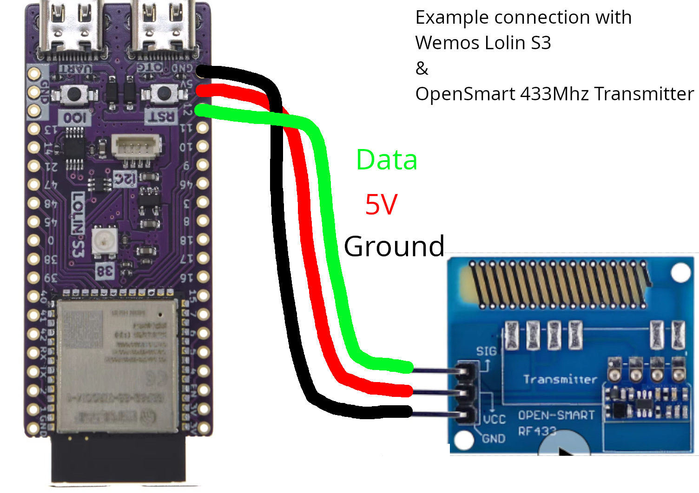

This guide mainly focuses on the parts listed in the [Hardware Buy guide](../quickstart/buying-guide.md).

## Requirements

+ ESP-32
+ 433 MHz transmitter
+ Soldering station
+ Hookup wire (optional, depending on whether the pins line up)

## What/Where to buy?

See the [Hardware Buy guide here](../quickstart/buying-guide.md). For the board/ESP-32 assembly you need the ESP-32 and a 433 MHz transmitter.

## Figuring out the PINs

Any digital output pin on your micro-controller should work for outputting the signal for the transmitter, however the default is often close to the positive and ground pins on the controller. See the [boards](../hardware/boards/index.md) section dedicated to the micro-controller you are using to decide which pin to use.

For example, if you bought a [Wemos Lolin S3](../hardware/boards/wemos/lolin-s3) and a [Open Smart Transmitter](../hardware/transmitter/china/open-smart.md), simply connect the 5V to the 5V pins (aka VCC), ground to ground, and any numbered pin to data, for example, the 12 pin.

!!! warning "Pins" Your data pin should be detected automatically by the OpenShock firmware. If the pin is not automatically selected (ie. the transmitter doesn't send any signals, or you aren't getting any voltage output) you can reflash the board and input the correct pin in the web UI, or open a UART terminal and send the command `rftxpin #` where `#` is your pin number.

