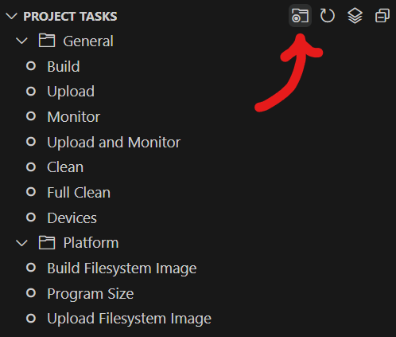

# Compiling from source

## Requirements  

- [VSCode](https://visualstudio.microsoft.com/#vscode-section)
- [PlatformIO IDE](https://marketplace.visualstudio.com/items?itemName=platformio.platformio-ide)

Clone [Openshock/Firmware](https://github.com/OpenShock/Firmware) to a folder on your PC.
Open the folder you just downloaded  with VSCode. Allow time for PlatformIO to initialize the IDE. Once it has completed, pick the project environment based on the board you would like to compile for under the new PlatformIO icon.

First run the `Device > Upload` task, then run `Platform > Upload Filesystem Image`. These tasks auto-build the latest changes and then upload the code to a connected micro-controller. This may require pressing the reset button on your micro-controller, refer to the documentation for your specific board for more information.
