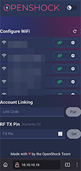
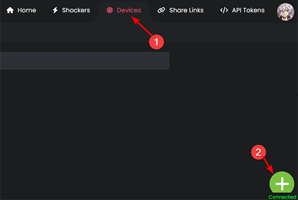
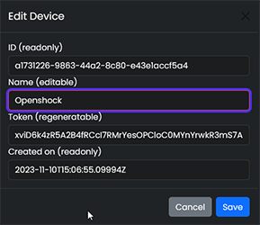
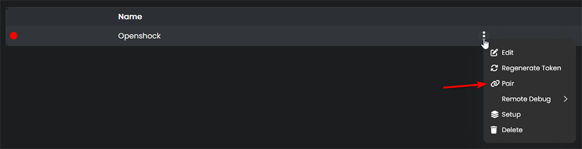
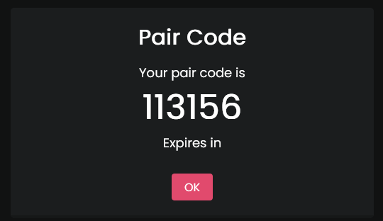
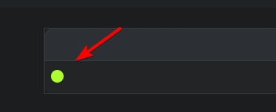
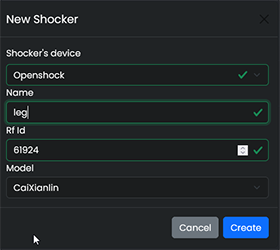

# Openshock - First time setup

!!! Warning
    **Don't wear the shocker somewhere near your neck or your heart.**  
    Check out [Safety](../safety/safety-rules.md) for more information.

## What you need
- USB cable with at least one USB-C connector and a PC _**or**_ USB Power adapter
- A Smartphone with a Webbrower (Chrome, firefox etc.)
- ESP board
- Shocker
- [Shocklink account](https://shocklink.net/)

## Setup ESP

1. To Setup your ESP (this is the communication device between the API and your shocker) you have to connect it to a power source, like a USB power adapter or your PC's USB Port (the ESP uses USB-C).
2. After you powered up your ESP grab your **phone** and search for a WiFi network named similar to this: ``Openshock-24:DC:C3:9F:72:C8`` and connect to it.  
  
3. Now open your **phones browser** and type in ``10.10.10.10`` or ``openshock.local`` this should give you a webinterface for the ESP that looks like this:  
  
4. Lookup your Wifi Network in the webinterface, press the green button next to it and type in your WiFi password then press submit.
5. Set the RF TX Pin, that is the number of the IO pin that the RF antenna data is connected to. (default 12, for pishock boards that is 15, if you don't know your pin, try asking for help on our [Discord](https://shocklink.net/discord)), type in your pin and press **Set** to change it.
6. **On your PC** open [Shocklink.net](https://shocklink.net/) and create an account, if you don't have one already, after that go to ``Devices`` and click the **green + icon** at the lower right corner to create a new device.   
  
7. Give it a name. To do that click on the **three dots** next to your newly created device's name and select **edit**, type in the name for the ESP (your name for example) into the name field, then press save.  
  
  
8. Click on the **three dots** again, this time select "**pair**" and press "**get pair code**", this will generate a pair code.  
  
  
9. On your **phone** type the code into the Account Linking field of the ESP's webinterface, then press "**Pair**"  
10. The setup of the ESP itself is done. yay! 🎉  
If everything went well it should show a **green icon** next to the device name on the website and the Acces Point of the ESP should be disabled, closing Wifi Network of the device.  
  

!!! Tip
    You can just plug and unplug your ESP, it should reconnect as soon as it is powered up again.

  
## Pair a shocker
1. Make sure you charged the shocker first.
2. Make sure your ESP ist connected to the website. ([Setup ESP](#setup-esp))
3. Go to [Shocklink.net](https://shocklink.net/) and login if you are not logged in already.
4. On Shocklink.net navigate to ``Shockers`` and click the green **+** icon at the bottom right corner, select your earlier created **device**, give it a **name** and select your **Model of shocker**, after that click create.  
 
 
6. Grab your shocker and turn it on, then hold the power button until it beeps and the LED is flashing fast, indicating that it is in pair mode.
6. On your website click the ``Speaker icon`` of your shocker, if your shocker now makes a sound, the pairing was successful.

7. Everything should work now, have fun! 🎉  
!!! Info
    Your shocker will remember the ESP, no need to repair it everytime.  

!!! Tip "Power Shocker On/Off"
    To turn your shocker ``off`` press the power button it should ``beep twice``.  
    To turn it back ``on`` press the power button it should ``beep once``.  

!!! Warning "Help"
    If you need additional help, join our [Discord](https://shocklink.net/discord)
