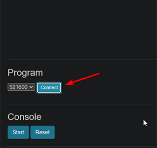
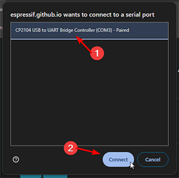
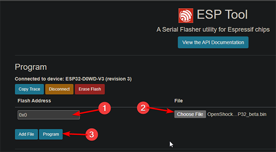

# How to flash the firmware

## What you need
- [ESP (Device)](../hardware/boards/index.md)
- A Chromium based browser like Google Chrome for example. **Firefox will not work since it doesn't support Web Serial**
- A flash tool like [ESP Tool](https://espressif.github.io/esptool-js/)
- The newest [Openshock firmware](https://github.com/OpenShock/Firmware/releases), make sure you download the firmware that is made for your kind of board.  

## Flashing the firmware
1. Plug your Device into your PC using a USB cable.
1. Open the [Flash tool](https://espressif.github.io/esptool-js/) with Chrome.
2. Click Connect, and select your Device in the Popup window.  
  
  
3. In the "Flash Address" field type in ``0x0``.
4. As "File" you select the downloaded ".bin" file from the Openshock GitHub which is the firmware.
5. Now click the "Program" button.  
  
6. Let it do it's thing and keep the window open, it'll tell you when it's done.
7. When everything went well you board will restart and you should be able to run through the [First Setup](../guides/openshock-first-setup.md) steps to configure your Device and link it to your shocker etc.  

!!! failure "What if something fails?"
    Make sure you used the correct firmware version for your board, otherwise join our [discord](https://discord.gg/OpenShock) and we will see how we can help you!