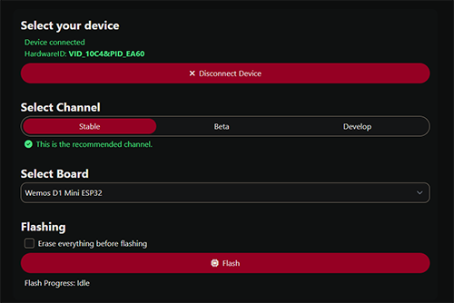

# How to flash the firmware

## What you need

- [OpenShock hub](../hardware/boards/index.md)
- A Chromium based web-browser (Chrome, Edge, Opera, etc.) **Firefox will not work since it doesn't support Web Serial**
- [Our Flashtool](https://next.openshock.app/flashtool)

!!! warning "Important"
    Ensure you have a cable that supports data transfer, and neither the port nor cable is damaged.

## Flashing the firmware

1. Plug your hub into your PC using a USB cable.
2. Open the [Flashtool](https://next.openshock.app/flashtool).
3. Click "Select Device" and select your hub in the Popup window.  
If your Device is not showing up click on "Install Drivers", after that repeat this step.

4. Ensure you have the "Stable" channel selected.
5. Ensure the correct board is selected.
  
6. Press Flash and let it do it's thing, keep the window open and it will tell you when it's done.  
7. When everything went well you board will restart and you should be able to run through the [First Setup](../guides/openshock-first-setup.md) steps to configure your hub and link it to your shocker etc.  
8. (Optional) If you have issues after flashing it try again with "Erase everything before flashing" enabled.  

!!! failure "Still not working?"
    Try again, if you still got problems after following this guide join our [Discord](https://discord.gg/OpenShock) and we will see how we can help you!
