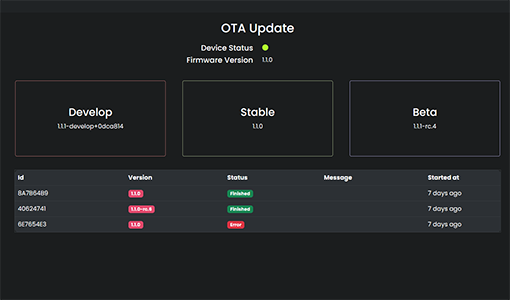

# How to Update

## What you need
- [Fully setup Device](../guides/openshock-first-setup.md)
- [Openshock account](https://openshock.app/)
- **Firmware 1.1.0 or newer**

## Over the Air Update (Recommended)
1. Login to [Openshock.app](https://openshock.app/)
2. Connect your Device to a power source and make sure it appears as Online in the Device section.
3. Open the context menu of your Device.
4. Select "OTA Update".  
  
5. Now you can see 3 different branches of firmware, these are "Develop", "Stable" and "Beta". **We recommend that you only use the Stable branch if you don't know what you're doing.**
6. If your firmware version is older than the one displayed on the "Stable" button, you should update.  
  
7. Click the "Stable" button. 
8. Confirm the Update.
9. Your Device should now update automatically, don't close the website during this.  
After it's done it should restart your Device and everything should just work™.

!!! failure "What if something fails?"
    If the update is not successful the updater will not overwrite anything and your Device should just stay on the old version.  
    Ask on the [Discord](https://discord.gg/OpenShock) for help.

## Using a Flash tool
This basically means re-flashing your firmware with a newer version, like it is explained in the [How to flash the firmware](../guides/openshock-how-to-flash-your-board.md) guide.  
**Doing it this way will also reset all your configuration.**