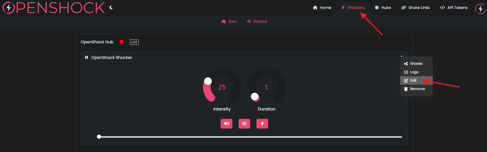

# Offline Remote Setup

## What you need

- [Fully setup OpenShock Hub](../guides/openshock-first-setup.md)
- [OpenShock Account](https://openshock.app/)
- A Compatible Offline remote with it's ID

!!! warning "Important"
    Currently it is only possible to use the Offline Remote to control a **single Shocker**

!!! warning "Important"
    If You bought an Offline Remote there should have been provided an **Offline Remote Id**

## Setup the Offline Remote
1. Login to the [website](https://openshock.app/)
2. Connect your hub to a power source and make sure it appears as online in the Device section.
2. Go to the **Shockers** section.
3. Edit the Shocker to Use with the Offline Remote  
    1. Open the Context Menu of the Shocker
    2. Select Edit
    3. Set the Shocker RfId field to the **Offline Remote ID**
    4. Save the Changes        
    ??? Info "Images (click to expand)"
        
        

4. RePair the Shocker
    1. Grab your shocker and turn it on. (Press the power button once. it should beep one time.)
    2. Hold the power button again until it beeps and the LED flashes fast. *This means the pair mode is active*
    3. On the website click the ***speaker icon*** of your shocker, if your shocker beeps in response, the pairing was successful.
    4. You must click the icon before the shocker's pairing mode times out (while the shocker's LED is flashing quickly).
    ??? Info "Images (click to expand)"
        
**Everything should work now, have fun!** 🎉
