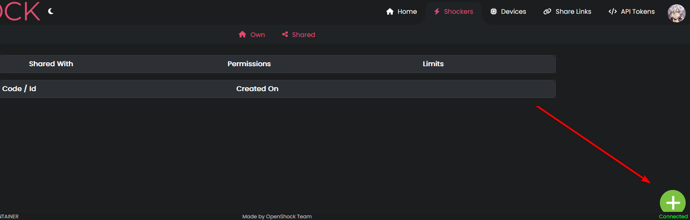
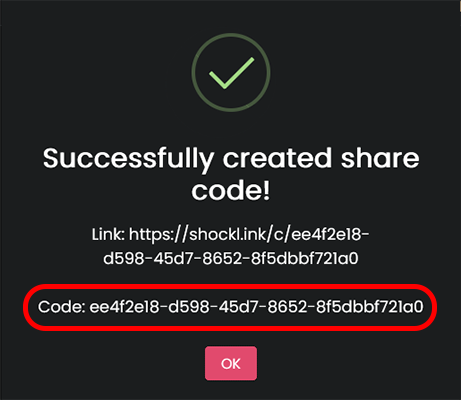
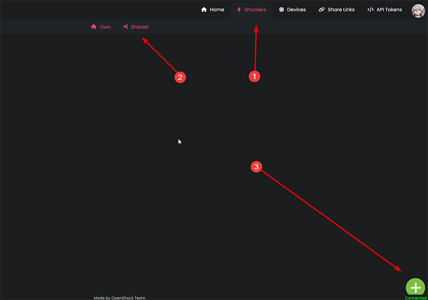
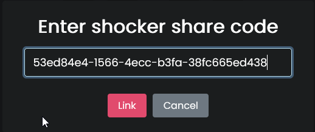
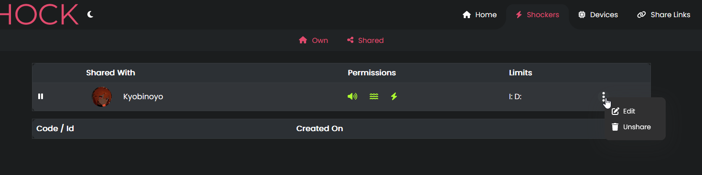

# Share codes

!!! question "What is a Share code?"
    Share codes make it possible for someone with a OpenShock.app account to directly control your shocker with their account.  
!!! Info "Share codes can only be used once! "
    You need to generate a new code every time you want to share the controls of your shocker with a new person.
    Shares are permanent until unshared/deleted by the owner of the shocker.  

## What you need

- [OpenShock account](https://openshock.app/)
- [A connected shocker](openshock-first-setup.md)

## Create a share code

1. Go to [OpenShock.app](https://openshock.app/) and login.
2. Switch to the **Shockers** section
    1. Open the context menu of the shocker you want to get a share code for. *(The three dots next to the name)*
    2. Select **Shares**.
    3. Click on the **green plus icon**, that will generate a new share code.
    4. Send this code to a person you trust.
    ??? Info "Images"
          
          
          

## Use a share code

1. Go to [OpenShock.app](https://openshock.app/) and login.
2. Switch to the [Shockers shared section](https://OpenShock.app/#/dashboard/shockers/shared).
    1. Click on the **green plus icon**.
    2. Type in the share code you received from someone.  

**Now the shocker is linked to your account and you can control it.** 🎉
??? Info "Images"
    
    
    
!!! Tip
    You can find all shockers you added with a share code on the same page in your account under **Shockers** -> [**Shared**](https://OpenShock.app/#/dashboard/shockers/shared)

## Edit share code limits

You can also set limits to every share code.  
!!! bug "Info"
    For this step to work, someone has to [use your share code](#use-a-share-code) first

1. Go to [OpenShock.app](https://openshock.app/) and login.
2. Switch to the **Shockers** section.
    1. Open up the context menu of the shocker you want to edit the code for.
    2. Select **Shares**.
        - After someone added your share code you should be able to see their account in the list.
    3. Open the Context Menu next to the persons account name.
    4. Select **Edit**
    5. Set max ***intensity*** and ***duration*** and also select what kind of ***commands*** the person can send.  
    6. Press **Save**, you are done. 🎉  
    ??? Info "Images"
        
        
        
        

## Pause/Unpause a share code

!!! bug "Info"
    For this step to work, someone has to [use your share code](#use-a-share-code) first

1. Go to [OpenShock.app](https://openshock.app/) and login.
2. Switch to the **Shockers** section.
    1. Open up the context menu of the shocker you want to pause the code for.
    2. Select **Shares**.
        - In this list there are *pause icons* next to the account names.
    3. Press the *pause icon* next to the person you want to pause the shocker for.
        - *Press the **play icon** next to the persons name to unpause the code again.*
    4. You are done. 🎉  
    ??? Info "Images"
        
        

## Unshare/Delete a share code

!!! bug "Info"
    For this step to work, someone has to [use your share code](#use-a-share-code) first

1. Go to [OpenShock.app](https://openshock.app/) and login.
2. Switch to the **Shockers** section.
    1. Open up the context menu of the shocker you want to unshare.
    2. Select **Shares**.
    3. Open the Context Menu next to the person you want to unshare.
    4. Select **Unshare**
    5. You are done. 🎉  
    ??? Info "Images"
        
        
        

!!! Tip
    You can also pause a specific share to temporarily stop the person from using this shocker.  
    Inside the share list, click the pause button in front of their account name, do the same again to un-pause it.  
  