<Callout type="error" title="Safety Warning">
  **Don't wear the shocker somewhere near your neck or your heart.** Check out
  [Safety](../../home/safety-rules.md) for more information.
</Callout>

<Callout type="error" title="Safety Warning">
  **Do not touch the pins of the shocker with both hands at the same time.** The electricity could
  flow through your heart.
</Callout>

## What you need

- USB cable suitable for your OpenShock hub.
- A stable power source. Try to avoid cheap power bricks — they can cause the device to crash under certain loads.
- A smartphone with a web browser (Chrome, Firefox, etc.)
- Your router's Wi-Fi password.
- [OpenShock hub](../../hardware/boards/index.md)
- [Shocker](../../hardware/shockers/index.md)
- [OpenShock account](https://openshock.app/)

## Setup the OpenShock hub

### Step 1: Wirelessly connect your phone to the hub

1. Plug your hub in and ensure it has power.
2. On your phone, search for a Wi-Fi network named similar to `OpenShock-XX:XX:XX:XX:XX:XX` and connect to it.

<Accordions>
  <Accordion title="Images (click to expand)">
    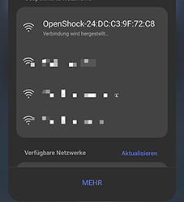
  </Accordion>
</Accordions>

### Step 2: Connect to the hub via the network

1. A web page should automatically pop up on your phone. If it does, skip to step 3 below.
2. If the page does **not** appear automatically:
   - Open your browser and go to `http://4.3.2.1`
   - If that doesn't work, try `http://10.10.10.10` instead
3. In the web interface, find your router's Wi-Fi network.
4. Press the green button next to it, enter your Wi-Fi password, and press **Submit**. _A green pop up should appear if it connected successfully._

<Accordions>
  <Accordion title="Images (click to expand)">
    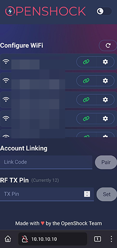
  </Accordion>
</Accordions>

### Step 3: Set the RF TX Pin (if needed)

<Callout type="warn" title="RF TX Pin">
  **DO NOT** change the RF TX Pin **UNLESS IT IS NOT AUTOMATICALLY DETECTED** _or_ you are using a
  DIY hub. This is an advanced feature. It should be set correctly by default after flashing the
  OpenShock firmware if you are using a known board. If the pin is not automatically selected, you
  can open a Serial terminal and send the command `rftxpin #` where `#` is your pin number. If you
  do not know how to do this, you can also re-enable the captive portal (hotspot of the Hub) to
  re-configure it. For more information see the page dedicated to your micro-controller under
  [boards](../../hardware/boards/index.md).
</Callout>

### Step 4: Create a hub on the website

1. **On your PC** open [openshock.app](https://openshock.app/).
2. Create an account _(if you don't have one already)_.
3. Navigate to **Hubs**.
4. Click the **green plus icon** at the lower right corner to create a new hub.
5. Give it a name:
   - Open the context menu of the hub _(the three dots next to the newly created hub)_.
   - Select **edit**.
   - Type in a name _(your name, for example)_ into the name field.
   - Press **save**.

<Accordions>
  <Accordion title="Images (click to expand)">
    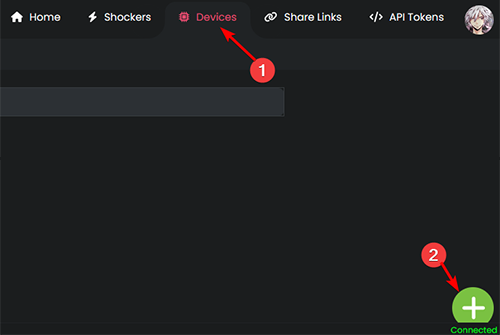

    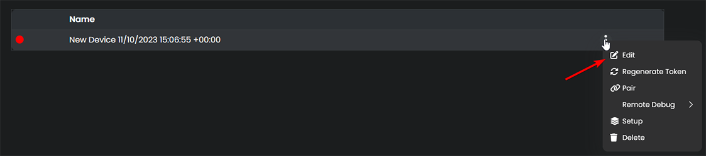

    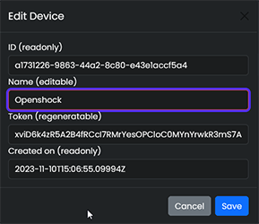

  </Accordion>
</Accordions>

### Step 5: Pair the hub

1. Open the context menu of your hub again.
2. Select **pair** and press **get pair code** — this will generate a new pair code.
3. On your phone, type the code into the account linking field of the hub's web interface, then press **pair**. After you link the hub to your account, it should shut down its own Wi-Fi network.

<Accordions>
  <Accordion title="Images (click to expand)">
    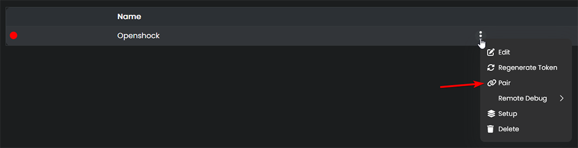

    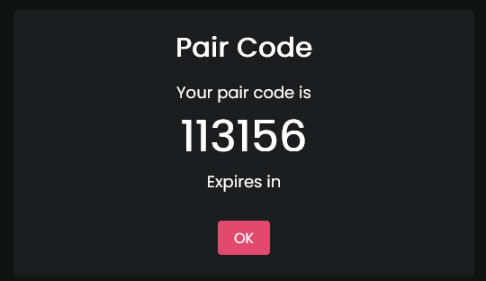

  </Accordion>
</Accordions>

### Step 6: The hub is now connected!

If everything went well, it should show a **green icon** next to the device name on the website.

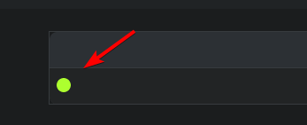

## Pairing shockers

### Step 1: Prerequisites

1. Ensure the shocker is sufficiently charged.
2. Ensure your hub is connected to the website. ([Setup the OpenShock hub](#setup-the-openshock-hub))

### Step 2: Create a Shocker

1. Go to [openshock.app](https://openshock.app/).
2. Log in if you are not already.
3. Navigate to **Shockers**.
4. Press the **green plus icon** at the bottom right corner.
5. Select the hub you created earlier.
6. Give your new shocker a name.
7. Select the **model** of shocker.
8. Click **Create**.

<Accordions>
  <Accordion title="Images (click to expand)">
    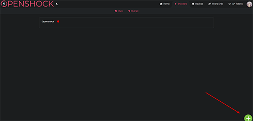

    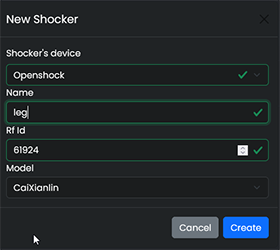

  </Accordion>
</Accordions>

### Step 3: Pair your Shocker

1. Grab your shocker and turn it on (press the power button once — it should beep once).
2. Hold the power button again until it beeps and the LED flashes fast. _This means pair mode is active._
3. On the website, click the **_speaker icon_** of your shocker. If your shocker beeps in response, the pairing was successful.
4. You must click the icon before the shocker's pairing mode times out (while the shocker's LED is flashing quickly).

<Accordions>
  <Accordion title="Images (click to expand)">
    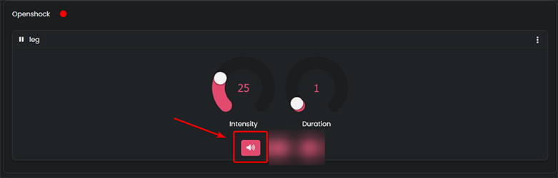
  </Accordion>
</Accordions>

**Everything should work now, have fun!** 🎉

<Callout type="info" title="Need Help?">
  If you need additional help, join our [Discord](https://discord.gg/OpenShock).
</Callout>

<Callout type="info">
  Your shocker will remember the hub — there is no need to pair it every time.
</Callout>
