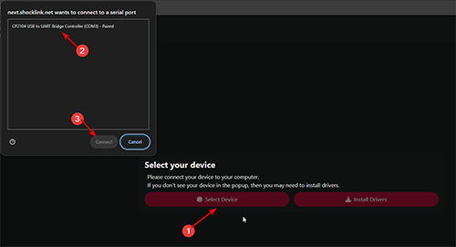
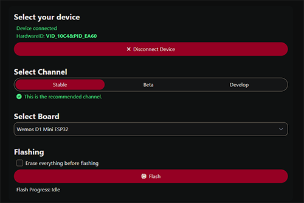
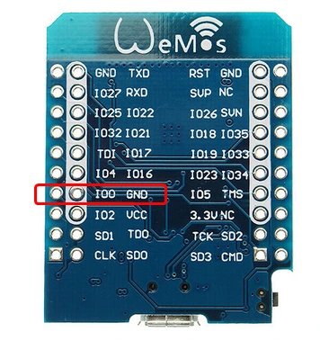
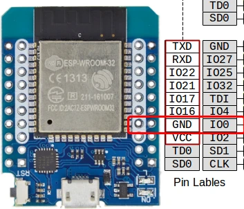

## What you need

- [OpenShock hub](../../hardware/boards/index.md)
- A Chromium based web-browser (Chrome, Edge, Opera, etc.) **Firefox will not work since it doesn't support Web Serial**
- [Our Flashtool](https://next.openshock.app/flashtool)

<Callout type="warn" title="Important">
Ensure you have a cable that supports data transfer, and neither the port nor cable is damaged.
</Callout>
<Callout type="info">
If you received your hub from an OpenShock hardware vendor, you can likely **skip this step**! Any updates can be [performed wirelessly](../openshock/how-to-update.md) after the initial setup.
</Callout>

## Flashing the firmware

<Steps>
<Step>
### Connect your hub

Plug your hub into your PC using a USB cable.
</Step>

<Step>
### Open the Flashtool

Open the [Flashtool](https://next.openshock.app/flashtool) and click "Select Device", then select your hub in the popup window. If your hub is not showing up, click "Install Drivers" first, then retry.

</Step>

<Step>
### Configure settings

Ensure you have the "Stable" channel selected and the correct [board](../../hardware/boards/index.md) is selected.

</Step>

<Step>
### Flash

Press Flash and let it do its thing. Keep the window open — it will tell you when it's done.
</Step>

<Step>
### First Setup

When everything went well, your board will restart and you should be able to run through the [First Setup](../openshock/first-setup.md) steps to configure your hub and link it to your shocker.

(Optional) If you have issues after flashing, try again with "Erase everything before flashing" enabled.
</Step>
</Steps>

## Troubleshooting

### (Re-)Install Driver

1. Download drivers from here [CP210x Universal Windows Driver](https://download.openshock.org/drivers/CP210x_Universal_Windows_Driver.zip)
2. Extract the zip file
3. Run the `CP210xVCPInstaller_x64.exe` installer file

### Different Cable

Try a couple of different USB cables, USB ports on your computer and if available on a different machine entirely.

### Manually start bootloader

Depending on the driver or board, your computer may fail putting the ESP32 into a flashable state.

Most boards will have a pair of buttons. The first button labelled "Boot", "IO0", or even just "B". The second labelled "Reset", "RST", or "EN".

First, attempt flashing **while holding down "Boot"**.

If that doesn't work, try holding down "Boot" and then tapping "Reset". That will reboot the ESP32, and also enter the bootloader, making it ready to receive new firmware!

Sometimes, you may need to both enter the bootloader manually *and* hold down "Boot" while starting the flashing process.

If you don't have a button, you can still usually short GPIO `0` to Ground while booting to enter the bootloader (for *most* ESP32s).

### Extra tip for ESP32-S and -C boards!

On some boards without firmware, you won't see a Serial port until you enter the Bootloader manually using the two-button steps above!

Example pins for the Wemos D1 Mini

### Manually flash using `esptool.py`

1. [Download esptool](https://github.com/espressif/esptool/releases/latest) (for windows the file is called something like `esptool-vx.x.x-win64.zip`)
2. [Download firmware .bin](https://github.com/OpenShock/Firmware/releases/latest) for your board
3. Extract the esptool zip file
4. Move the downloaded firmware `.bin` file into the folder with `esptool.exe`
5. Open a command line (`cmd` or `powershell`) in that folder
6. Execute the command `esptool write_flash 0x0 OpenShock_xxx-name-xxx.bin`. Replace firmware name with your actual file name.
7. Wait for it to complete flashing and you should be ready to go!

### Manually flash using `espflash` (alternative to `esptool.py`)

1. Download via [GitHub here](https://github.com/esp-rs/espflash/releases) (or if you have Rust's [cargo](https://doc.rust-lang.org/cargo/) installed, you can run `cargo install espflash`).
2. [Download firmware .bin](https://github.com/OpenShock/Firmware/releases/latest) for your board
3. Extract espflash
4. Move the downloaded firmware `.bin` file into the folder with `espflash.exe`
5. Open a command line (`cmd` or `powershell`) in that folder
6. Execute the command `espflash write-bin 0x0 OpenShock_xxx-name-xxx.bin`. Replace firmware name with your actual file name.
7. Wait for it to complete flashing and you should be ready to go!

<Callout type="error" title="Still not working?">
Try again, if you still got problems after following this guide join our [discord](https://discord.gg/OpenShock) and we will see how we can help you!
</Callout>
