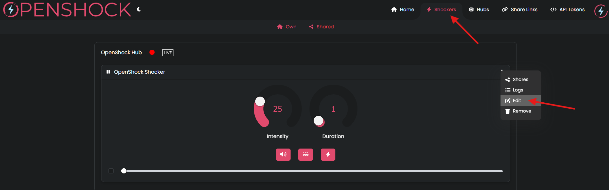
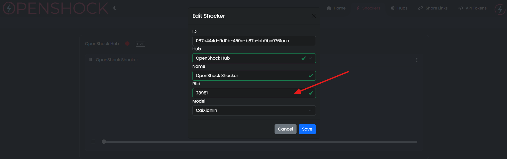

## What you need

- [Fully setup OpenShock Hub](first-setup)
- [OpenShock Account](https://openshock.app/)
- A compatible offline remote with its ID

<Callout type="warn" title="Important">
  Only the first channel on the remote will work. This is because the channel is not yet
  configurable on OpenShock's side.
</Callout>

<Callout type="warn" title="Offline Remote ID">
  If you bought an offline remote from a vendor, it might already have been decoded and the
  **Offline Remote ID** might be present as a sticker on the remote. You can also decode this ID
  yourself using a 433 MHz receiver module with an ESP32 — check out the [rf-playground
  repo](https://github.com/OpenShock/rf-playground).
</Callout>

## Setup the Offline Remote

1. Log in to the [website](https://openshock.app/).
2. Connect your hub to a power source and make sure it appears as online in the Hubs section.
3. Go to the **Shockers** section.
4. Edit the Shocker to use with the Offline Remote:
   - Open the context menu of the Shocker.
   - Select **Edit**.
   - Set the Shocker **RfId** field to the **Offline Remote ID**.
   - Save.
5. Re-pair the Shocker.

<Accordions>
  <Accordion title="Images (click to expand)">
    

    

  </Accordion>
</Accordions>

**Everything should work now, have fun!** 🎉
