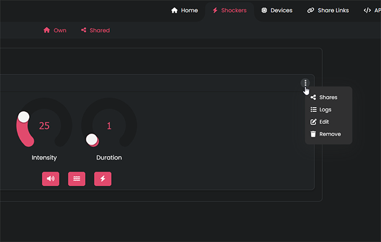
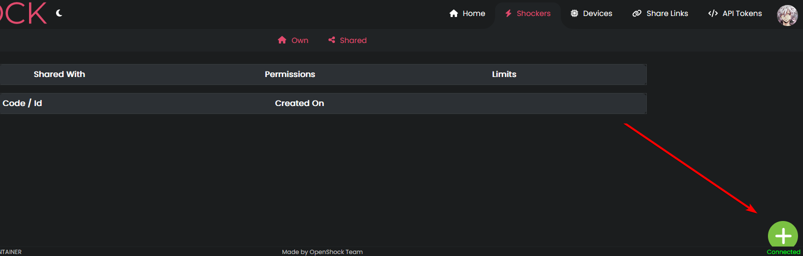
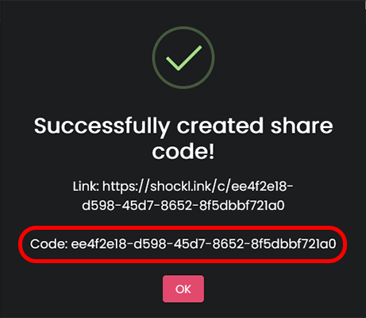
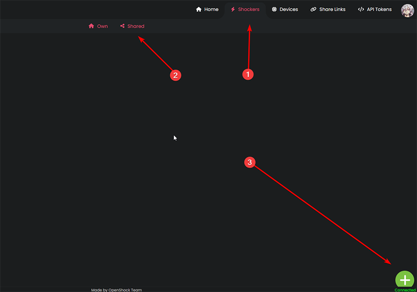
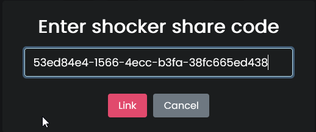
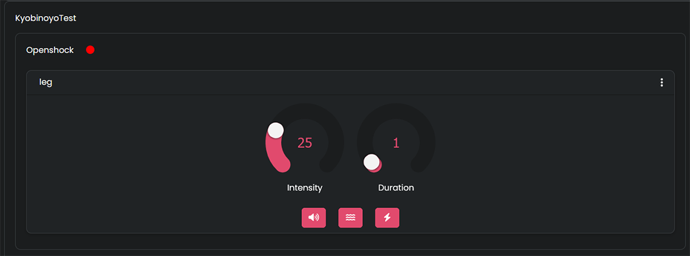
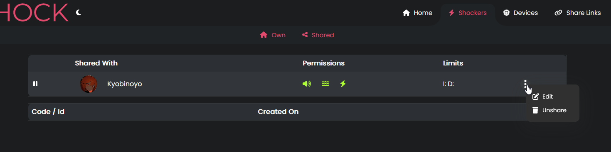
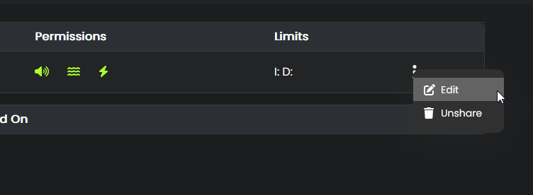
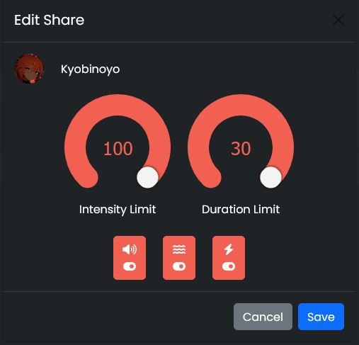

<Callout type="info" title="What is a Share code?">
  Share codes make it possible for someone with an openshock.app account to directly control your
  shocker with their account.
</Callout>

<Callout type="info" title="Share codes can only be used once!">
  You need to generate a new code every time you want to share the controls of your shocker with a
  new person. Shares are permanent until unshared/deleted by the owner of the shocker.
</Callout>

## What you need

- [OpenShock account](https://openshock.app/)
- [A connected shocker](./first-setup.md)

## Create a share code

1. Go to [openshock.app](https://openshock.app/) and log in.
2. Switch to the **Shockers** section.
3. Open the context menu of the shocker you want a share code for _(the three dots next to the name)_.
4. Select **Shares**.
5. Click on the **green plus icon** to generate a new share code.
6. Send this code to a person you trust.

<Accordions>
  <Accordion title="Images (click to expand)">
    

    

    

  </Accordion>
</Accordions>

## Use a share code

1. Go to [openshock.app](https://openshock.app/) and log in.
2. Switch to the [Shockers shared section](https://openshock.app/#/dashboard/shockers/shared).
3. Click on the **green plus icon**.
4. Type in the share code you received from someone.

**Now the shocker is linked to your account and you can control it.** 🎉

<Accordions>
  <Accordion title="Images (click to expand)">
    

    

    

  </Accordion>
</Accordions>

<Callout type="success">
  You can find all shockers you added with a share code on the same page in your account under
  **Shockers** → [**Shared**](https://openshock.app/#/dashboard/shockers/shared).
</Callout>

## Edit share code limits

You can also set limits on every share code.

<Callout type="error" title="Info">
  For this step to work, someone has to [use your share code](#use-a-share-code) first.
</Callout>

1. Go to [openshock.app](https://openshock.app/) and log in.
2. Switch to the **Shockers** section.
3. Open the context menu of the shocker you want to edit the code for.
4. Select **Shares**. After someone added your share code, you should be able to see their account in the list.
5. Open the context menu next to the person's account name.
6. Select **Edit**.
7. Set the max **_intensity_** and **_duration_**, and also select what kind of **_commands_** the person can send.
8. Press **Save** — you are done. 🎉

<Accordions>
  <Accordion title="Images (click to expand)">
    

    

    

    

  </Accordion>
</Accordions>

## Pause/Unpause a share code

<Callout type="error" title="Info">
  For this step to work, someone has to [use your share code](#use-a-share-code) first.
</Callout>

1. Go to [openshock.app](https://openshock.app/) and log in.
2. Switch to the **Shockers** section.
3. Open the context menu of the shocker you want to pause the code for.
4. Select **Shares**. In this list there are _pause icons_ next to the account names.
5. Press the _pause icon_ next to the person you want to pause the shocker for. _(Press the **play icon** next to the person's name to unpause the code again.)_
6. You are done. 🎉

<Accordions>
  <Accordion title="Images (click to expand)">
    

    

  </Accordion>
</Accordions>

## Unshare/Delete a share code

<Callout type="error" title="Info">
  For this step to work, someone has to [use your share code](#use-a-share-code) first.
</Callout>

1. Go to [openshock.app](https://openshock.app/) and log in.
2. Switch to the **Shockers** section.
3. Open the context menu of the shocker you want to unshare.
4. Select **Shares**.
5. Open the context menu next to the person you want to unshare.
6. Select **Unshare**.
7. You are done. 🎉

<Accordions>
  <Accordion title="Images (click to expand)">
    

    

    

  </Accordion>
</Accordions>

<Callout type="success">
  You can also pause a specific share to temporarily stop the person from using this shocker. Inside
  the share list, click the pause button in front of their account name — do the same again to
  un-pause it.
</Callout>
