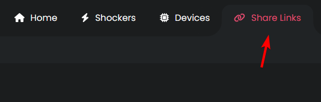
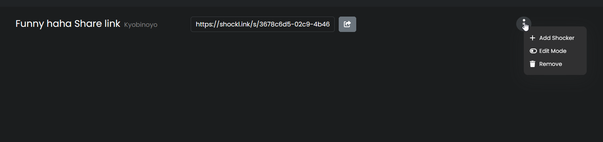
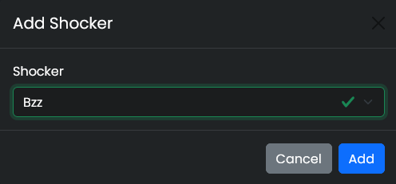
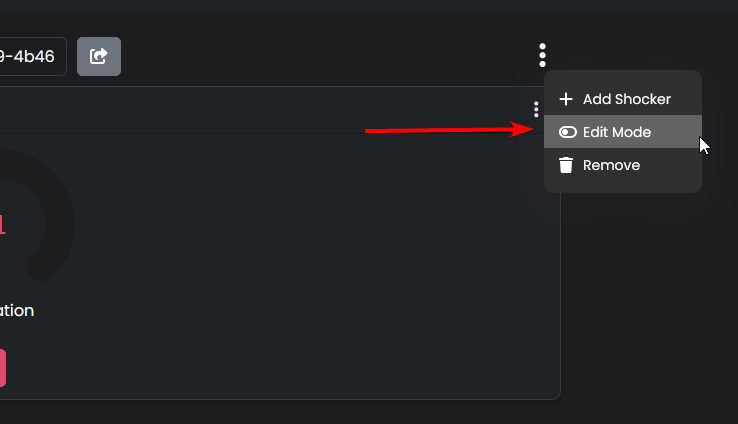
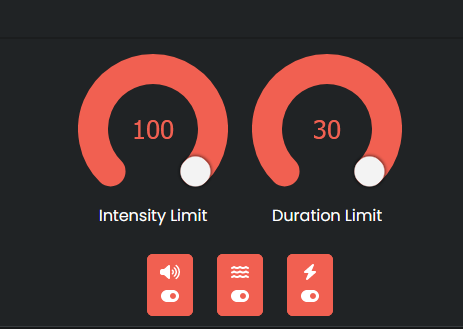
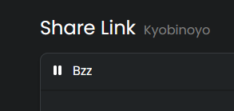

<Callout type="info" title="What is a Share link?">
  Share links are a great way to give people control of your shockers without the need of a
  OpenShock account.
</Callout>
## What you need - [OpenShock account](https://openshock.app/) - [A connected
shocker](./first-setup.md)

## How to create a Share link

1. Create the Link:
   1. Open [OpenShock.app](https://openshock.app/).
   2. Go to the **Share Links** section.
   3. Click **Add new share link!**
   4. Give it a **name**.
      - (optional) Set an expiry date.
   5. Press **Create** - Your new share link should popup as a new entry on the page.
      <Accordions>
        <Accordion title="Images (click to expand)">
             
        </Accordion>
      </Accordions>
2. Add a Shocker to the Link: 1. Click on the newly created link. 2. Open the Context Menu _(the three dots on the right side open the **context menu** of the link.)_ 3. Click on **Add shocker** 4. Select your Shocker. 5. Press **Add** _(repeat that to add more shockers)_ - You should be able to see the shockers controls now.
   <Accordions>
   <Accordion title="Images (click to expand)">
     
    
   </Accordion>
   </Accordions>
   **That's it.**  
   Everyone you send the share link to can now control your shocker. 🎉

<Callout type="success">
  Create multiple share links for different people to have better control over who can shock you!
</Callout>
## Customize your Share link

<Callout type="info">
  You can set limits to **intensity**, **duration** or what kind of **command** someone can use for
  each share link. You can also **Pause** the link so nobody can send commands with this link.
</Callout>
### Edit the limits

1. Go to your [share link page](https://openshock.app/#/dashboard/shares/links) and select the share link you want to edit. 1. Open the share links **Context Menu** 2. Select **Edit Mode**. - The shocker controls should change to orange indicating the **Edit Mode**. 3. Set the maximum **_intensity_**, **_duration_** and choose what kind of **_command_** can be send. 4. To exit the Edit Mode open the share links context menu and select **Edit Mode** again. This will return the controls to their normal color.
   <Accordions>
   <Accordion title="Images (click to expand)">
   
   
   </Accordion>
   </Accordions>
   **That's it.** 🎉

### Pause your Share link

<Callout type="info">A paused link will not accept any commands.</Callout>
1. Go to your [share link page](https://openshock.app/#/dashboard/shares/links) and select the share
link you want to ***pause***. 1. Click on the little pause icon next to the share links name. - It
should now ***blur*** the shocker controls telling you it's paused. 2. To un-pause the share link
again simply click on the ``Play Icon``.
<Accordions>
  <Accordion title="Images (click to expand)">
     
  </Accordion>
</Accordions>
