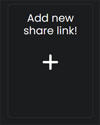
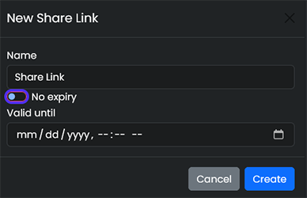
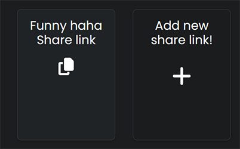
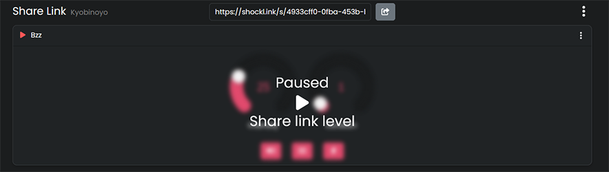

<Callout type="info" title="What is a Share link?">
  Share links are a great way to give people control of your shockers without the need of an
  OpenShock account.
</Callout>

## What you need

- [OpenShock account](https://openshock.app/)
- [A connected shocker](./first-setup.md)

## How to create a Share link

1. Open [OpenShock.app](https://openshock.app/).
2. Go to the **Share Links** section.
3. Click **Add new share link!**
4. Give it a **name** (and optionally set an expiry date).
5. Press **Create**. Your new share link should pop up as a new entry on the page.

<Accordions>
  <Accordion title="Images (click to expand)">
    

    

    

    

  </Accordion>
</Accordions>

### Add a Shocker to the Link

1. Click on the newly created link.
2. Open the **context menu** _(the three dots on the right side of the link)_.
3. Click on **Add shocker**.
4. Select your Shocker.
5. Press **Add** _(repeat to add more shockers)_. You should be able to see the shocker controls now.

<Accordions>
  <Accordion title="Images (click to expand)">
    

    

  </Accordion>
</Accordions>

**That's it.** Everyone you send the share link to can now control your shocker. 🎉

<Callout type="success">
  Create multiple share links for different people to have better control over who can shock you!
</Callout>

## Customize your Share link

<Callout type="info">
  You can set limits to **intensity**, **duration** or what kind of **command** someone can use for
  each share link. You can also **Pause** the link so nobody can send commands with this link.
</Callout>

### Edit the limits

1. Go to your [share link page](https://openshock.app/#/dashboard/shares/links) and select the share link you want to edit.
2. Open the share link's **context menu**.
3. Select **Edit Mode**. The shocker controls should change to orange, indicating **Edit Mode**.
4. Set the maximum **_intensity_**, **_duration_** and choose what kind of **_command_** can be sent.
5. To exit Edit Mode, open the context menu and select **Edit Mode** again. This will return the controls to their normal color.

<Accordions>
  <Accordion title="Images (click to expand)">
    

    

  </Accordion>
</Accordions>

**That's it.** 🎉

### Pause your Share link

<Callout type="info">A paused link will not accept any commands.</Callout>

1. Go to your [share link page](https://openshock.app/#/dashboard/shares/links) and select the share link you want to **_pause_**.
2. Click on the little pause icon next to the share link's name. It should now **_blur_** the shocker controls, telling you it's paused.
3. To un-pause the share link again, simply click on the `Play Icon`.

<Accordions>
  <Accordion title="Images (click to expand)">
    

    

  </Accordion>
</Accordions>
