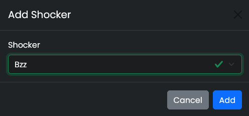
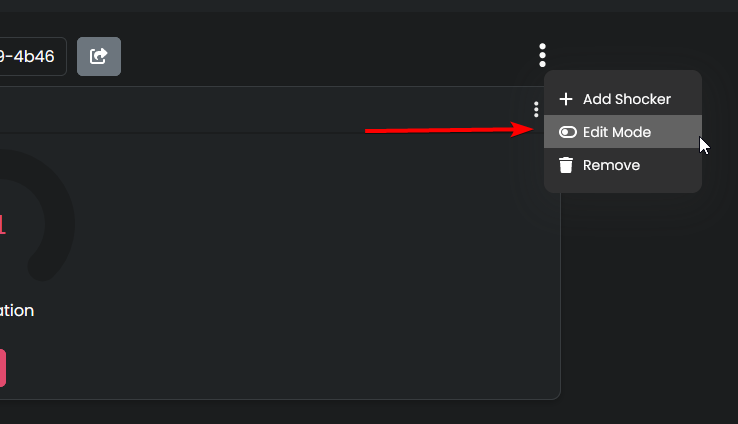
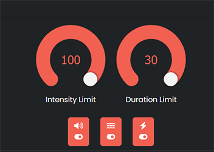
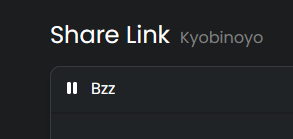

# Share links

!!! danger "Safety Warning"
    **Don't wear the shocker somewhere near your neck or your heart.**  
    Check out [Safety](../safety/safety-rules.md) for more information. 

!!! question "What is a Share link?"
    Share links are a great way to give people control of your shockers without the need of a Shocklink account.  

## What you need
- [Shocklink.net account](https://shocklink.net/)
- A working shocker ([see the First time Setup guide](openshock-first-setup.md))

  

## How to create a Share link

  1. Create the Link:
    1. Open [Shocklink.net](https://shocklink.net/).
    2. Go to the **Share Links** section.  
    3. Click **Add new share link!**    
    4. (optional) Set an expiry date.
    5. Give it a **name**.
    6. Press **Create**
      * Your new share link should popup as a new entry on the page.      
    ??? Info "Image"
          
          
          
          
  2. Add a Shocker to the Link: 
    1. Click on the newly created link.
    2. Open the Context Menu *(the three dots on the right side open the **context menu** of the link.)*
    3. Click on **Add shocker**
    4. Select your Shocker.
    5. Press **Add** *(repeat that to add more shockers)*
        * You should be able to see the shockers controls now.
    ??? Info "Images"
          
          
**That's it.**  
Everyone with the share link can now control your shocker. 🎉  

!!! Tip
    Create multiple share links for different people to have better control over who can shock you!

  

## Customize your Share link
!!! Info
    You can set limits to _*intensity*_, _*duration*_ or what kind of _*command*_ someone can use for each share link.  
    You can also _*Pause*_ the link so nobody can send commands with this link.  
### Edit the limits  
  1. Go to your [share link page](https://shocklink.net/#/dashboard/shares/links) and select the share link you want to edit.
    1. Open the share links **Context Menu** 
    2. Select **Edit Mode**.
        * The shocker controls should change to orange indicating the **Edit Mode**.
    3. Set the maximum _**intensity**_, _**duration**_ and choose what kind of _**command**_ can be send.
    4. To exit the Edit Mode open the share links context menu and select **Edit Mode** again. This will return the controls to their normal color.
    ??? Info "Images"
        
         
  **That's it.** 🎉

### Pause your Share link
!!! Info
    A paused link will not accept any commands.  
  1. Go to your [share link page](https://shocklink.net/#/dashboard/shares/links) and select the share link you want to _**pause**_.
    1. Click on the little pause icon next to the share links name.  
      * It should now _**blur**_ the shocker controls telling you it's paused.
    ??? Info "Image" 
         
2. To un-pause the share link again simply click on the ``Play Icon``.
??? Info "Image"
      

  

  
