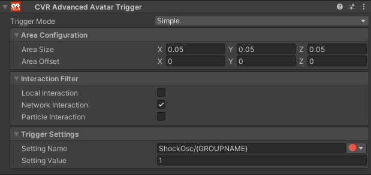
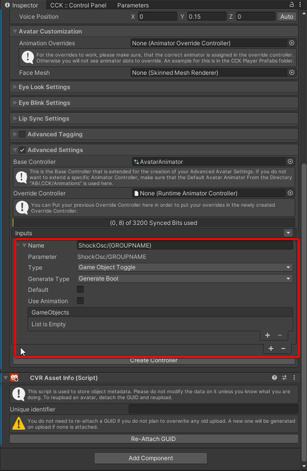

# ChilloutVR Avatar Setup

## What you need

- [ShockOsc](shockosc-basic.md)
- A ChilloutVR avatar
- Basic experience in working with ChilloutVR avatars is recommended  
- A OSC mod for ChilloutVR

!!! Info "Special ShockOsc Settings for ChilloutVR"
    Please make sure you have "OSC Query" turned off in the **App Settings** tab.  

## Touch Trigger

1. Open your Project
2. Create an Advanced Avatar Trigger  
    1. Select the Bone of you avatar you want the trigger to be.
    2. Create a new empty Game object and name it however you like.  
      
    3. Add the "CVR Advanced Avatar Trigger" component to it.  
    4. Configure it like followed and replace {GROUPNAME} with the name of your ShockOsc group. ``ShockOsc/Bzz`` for example:  
      
    5. Make sure the trigger area is appropriate for you.
3. Add the Parameter to your Animator as a bool.  
4. Add the Parameter to your Menu as a bool.  
  
5. That's it. 🎉  

## List of available parameters

=== "Avatar Dynamic Parameters "
    !!! Info "``ShockOsc/{GroupName}`` (bool)"
        when set to ``true`` and held, will trigger a normal shock in ShockOSC

    !!! Info "``ShockOsc/{GroupName}_Stretch`` (float)"  
        can be used to control the shock intensity  
        (ex. stretch a bone to 50% and let go to get shocked for 50% intensity)  

    !!! Info "``ShockOsc/{GroupName}_IsGrabbed`` (bool)"   
        mainly used  to indicate that a Physbone is grabbed

    !!! Info "``ShockOsc/{GroupName}_IShock``  (bool)" 
        if set to ``true`` will shock immediately ignoring the configured ``HoldTime``.  

=== "Visual Parameters"
    !!! Info "``ShockOsc/{GroupName}_Active`` (bool)"
        can be used to display an active shock on your avatar (when the shocker is active, ShockOSC will set this to ``true`` if not it will be ``false``)

    !!! Info "``ShockOsc/{GroupName}_Cooldown`` (bool)"
        can be used to read out if the shocker is on cooldown  

    !!! Info "``ShockOsc/{GroupName}_CooldownPercentage`` (float)"
        Reads out the shocker cooldown, 1 means cooldown and 0 means no cooldown.
        can be used to make a cooldown timer for example.  
        
    !!! Info "``ShockOsc/{GroupName}_Intensity``  (float)"
        represents how close the shock was to your configured max intensity.

=== "Dummy Shockers"  
    !!! Info "``_All``"
        can be used in place of a group name, **represents all** shockers on your account.  
        (ex: if **ShockOsc/_All** is set to ``true`` on you Avatar, all of your shockers will be triggered at the same time)

    !!! Info "``_Any``"
        can be used in place of a group name, **represents any** shocker on your account.  
        (ex: if at least one of your shockers are currently shocking **ShockOsc/_Any_Active** will be ``true``)  

=== "Config Parameters"  
    !!! Info "``ShockOsc/_Config/_All/Paused`` (bool)"
        It's a kind of killswitch, pausing ShockOSC.  

    !!! Info "``ShockOsc/_Config/_All/MinIntensity`` (Float)"
        Sets Minimum Intensity for the Random Mode.

    !!! Info "``ShockOsc/_Config/_All/MaxIntensity`` (Float)"
        Sets Maximum Intensity for the Random Mode.  

    !!! Info "``ShockOsc/_Config/_All/MinDuration`` (Float)"
        Sets Minimum Duration for the Random Mode.  

    !!! Info "``ShockOsc/_Config/_All/MaxDuration`` (Float)"
        Sets Maximum Duration for the Random Mode.  
    
    !!! Info "``ShockOsc/_Config/_All/Duration`` (Float)"
        Sets Duration Time for the Fixed Mode (100% = 10 Sec.) 
    
    !!! Info "``ShockOsc/_Config/_All/Intensity`` (Float)"
        Sets Intensity for the Fixed Mode.
    
    !!! Info "``ShockOsc/_Config/_All/ModeIntensity`` (Float)"
        Toggles between Fixed and Random Intensity Mode (True = Random)  

    !!! Info "``ShockOsc/_Config/_All/ModeDuration`` (Float)"
        Toggles between Fixed and Random Duration Mode (True = Random)   

    !!! Info "``ShockOsc/_Config/_All/CooldownTime`` (Float)"
        Sets the desired cooldown time.  (0 - 100 sec.)

    !!! Info "``ShockOsc/_Config/_All/HoldTime`` (Float)"
        Sets the time needed to hold the trigger to activate a shock.
