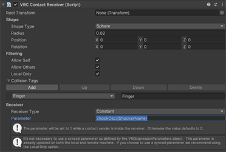

# ShockOsc - VRChat Avatar Setup 
  
## Add a touch trigger to your Avatar
1. Open your avatar project and create a new ``Empty GameObject`` on the bone you want your trigger to be at, your LeftLeg for example.  
  

2. Click on the new object and rename it however you want, for example "ShockOSC", after that select it and add a new ``VRC Contact Receiver`` component and position the object on your avatar.  
  

3. Configure the components ``Radius``, ``Filtering``, ``Collision Tags`` and of course the ``Parameter``, the parameter need to follow a specific naming scheme. ``ShockOsc/{ShockerName}`` and "{ShockerName}" needs to be replaced by the name you gave your shocker in the ShockOsc config, for example ``ShockOsc/leftleg``.  

!!! Info "Replace "ShockerName" with the one in your ShockOsc config, like this"
      

  
Now upload your Avatar and you are ready to go!
  
!!! Info "Avatar Update Info"
    If you update an existing avatar, make sure you delete the OSC config files in ``C:\Users\%USERPROFILE%\AppData\LocalLow\VRChat\VRChat\OSC``, they are not important for the game since they only hold the avatar parameters for OSC to use, they get regenerated everytime you change your avatar, but VRChat fails to update them somethimes when a new parameter got added to an Avatar. 
