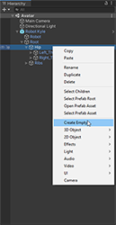
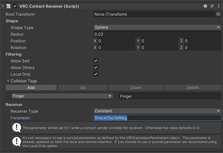

# VRChat Avatar Setup 
  
## What you need
- [ShockOsc](shockosc-basic.md)
- A VRChat avatar
- Basic experience in working with VRChat avatars is recommended

<br></br>

## Touch trigger
1. Open your avatar project and create a new ``Empty GameObject`` on the bone you want your trigger to be at, your LeftLeg for example.  
  

2. Click on the new object and rename it to whatever you want, for example "ShockOSC", add a new ``VRC Contact Receiver`` component to it and position the object on your avatar.  
  

3. Configure the **VRC Contact Receiver** component:  
    - **Radius** : That's the range of the trigger, don't make it too big otherwise people will constantly trigger it by accident.
    - **Filtering**: ``Local Only`` should definetily be used, but it's on you if you use ``Allow Self``, ``Allow Others`` or both of these. This will decide if other people or you can trigger the shocker by touching it.
    - **Collision Tags**: I recommend that you at least use the ``Finger`` Tag, otherwise people can't touch the trigger with their fingers, but is's up to you what kind of tags you use.
    - **Receiver Type**: this needs to be set to ``constant``.
    - **Parameter**: ``ShockOsc/{ShockerName}``  
      Replace *{ShockerName}* by the name you gave your shocker in the ShockOsc config.  
      Example: ``ShockOsc/leftleg``.  
!!! example
    === "Component"
        
    === "ShockOsc Config"
        ```json
        "Shockers": {
        "leftleg": "18b1d0e6a-f9a0-4e93-9812-241eae9271791"
        }
        ```
        No idea what this is? Check out the [ShockOsc Basic setup guide](shockosc-basic.md)
Now upload your Avatar and you are ready to go! 🎉  

!!! bug "Activate OSC"
    Make sure that you have [enabled OSC](https://docs.vrchat.com/docs/osc-overview#enabling-it) inside VRChat.  

!!! Tip "Avatar Update Info"
    If you update an existing avatar, make sure you delete the OSC config files in ``C:\Users\%USERPROFILE%\AppData\LocalLow\VRChat\VRChat\OSC``, they are not important for the game since they only hold the avatar parameters for OSC to use, they get regenerated every time you change your avatar, but VRChat fails to update them sometimes when a new parameter got added to an Avatar. 

    Reload your Avatar after that.

<br></br>

## Remote trigger
!!! info "Still brewing!"

    Sorry, we haven't _quite_ gotten around to writing this set of articles just yet. **In the meantime, feel free to hit us up on [Discord](https://discord.gg/AHcCbXbEcF).**

<br></br>

## Pull trigger
!!! info "Still brewing!"

    Sorry, we haven't _quite_ gotten around to writing this set of articles just yet. **In the meantime, feel free to hit us up on [Discord](https://discord.gg/AHcCbXbEcF).**

<br></br>

## Pause toggle
!!! info "Still brewing!"

    Sorry, we haven't _quite_ gotten around to writing this set of articles just yet. **In the meantime, feel free to hit us up on [Discord](https://discord.gg/AHcCbXbEcF).** 

<br></br>

## List of available parameters

=== "Avatar Dynamic Parameters "
    !!! Info "``ShockOsc/{ShockerName}`` (bool)"
        when set to ``true`` and held, will trigger a normal shock in ShockOSC
        

    !!! note "``ShockOsc/{ShockerName}_Stretch`` (float)"  
        can be used to control the shock intensity  
        (ex. stretch a bone to 50% and let go to get shocked for 50% intensity)  

    !!! Info "``ShockOsc/{ShockerName}_IsGrabbed`` (bool)"   
        mainly used  to indicate that a Physbone is grabbed

    !!! note "``ShockOsc/{ShockerName}_IShock``  (bool)" 
        if set to ``true`` will shock immediately ignoring the configurated ``HoldTime``.  

=== "Visual Parameters"
    !!! Info "``ShockOsc/{ShockerName}_Active`` (bool)"
        can be used to display an active shock on your avatar (when the shocker is active, ShockOSC will set this to ``true`` if not it will be ``false``)

    !!! note "``ShockOsc/{ShockerName}_Cooldown`` (bool)"
        can be used to read out if the shocker is on cooldown  

    !!! Info "``ShockOsc/{ShockerName}_CooldownPercentage`` (float)"
        Reads out the shocker cooldown, 1 means cooldown and 0 means no cooldown.  
        can be used to make a loading bar for example.  
        
    !!! note "``ShockOsc/{ShockerName}_Intensity``  (float)"
        represents how close the shock was to maximum intensity from ``IntensityRange``

=== "Dummy Shockers"  
    !!! Info "``_All``"
        can be used in place of a shocker name, **represents all** shockers configured in the ShockOSC config.  
        (ex: if **ShockOsc/_All** is set to ``true`` on you Avatar, every shocker configured in ShockOSC will be triggered at the same time)

    !!! note "``_Any``"
        can be used in place of a shocker name, **represents any** shocker configured in the ShockOSC config.  
        (ex: if at least one of your shockers are currently shocking **ShockOsc/_Any_Active** will be ``true``)  

=== "Config Parameters"  
    !!! Info "``ShockOsc/_Config/Paused`` (bool)"
        As long as this parameter is ``true``, all activity by ShockOsc will be paused, shockers will still receive commands via [Share links](shocklink-sharelinks.md) and Share codes.  
<!--
| Parameter                           | Type    | Description                                                                                                         |
| :---------------------------------- | :-----: | :------------------------------------------------------------------------------------------------------------------ |
| `ShockOsc/{ShockerName}`            | Bool    | when set to ``true`` and held, will trigger a normal shock in ShockOSC                                              |
| `ShockOsc/{ShockerName}_Stretch`    | Float   | can be used to control the shock intensity (ex. stretch a bone to 50% and let go to get shocked for 50% intensity)  |
| `ShockOsc/{ShockerName}_IsGrabbed`  | Bool    | mainly used  to indicate that a Physbone is grabbed                                                                 |
| `ShockOsc/{ShockerName}_IShock`     | Bool    | if set to ``true`` will shock immediately ignoring the configurated ``HoldTime``.                                   |
-->