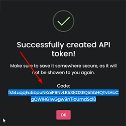
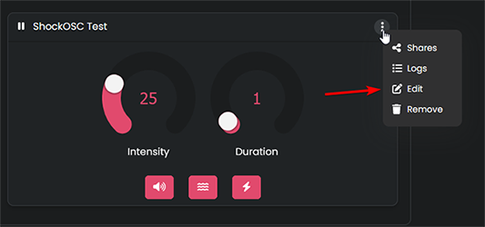
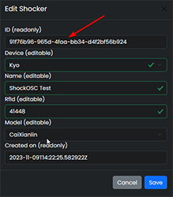

# Basic Setup

!!! danger "Safety Warning"
    **Don't wear the shocker somewhere near your neck or your heart.**  
    Check out [Safety](../safety/safety-rules.md) for more information.  

!!! question "What is ShockOsc?"
    ShockOsc is an application made for Shocklink that uses OSC to trigger your shockers from an in-game command.  
    OSC is a service implemented in VRChat that allows the communication between the game and 3rd party applications.  

## What you need

- [Fully setup shocker](openshock-first-setup.md)
- [Newest ShockOsc](https://github.com/OpenShock/ShockOsc/releases)
- Text editor, Notepad or [Notepad++](https://notepad-plus-plus.org/) for example

<br></br>

## Setup ShockOsc
1. [Download](https://github.com/OpenShock/ShockOsc/releases) and store the ``ShockOsc.exe`` file at your desired location on your PC.  
   (at the moment there are two ShockOsc.exe files to download, you only need the ``OpenShock.ShockOsc.exe``)  
2. Start the .exe for the first time, this will generate a ``config.json`` file in the same location as the .exe, press any button to close the window again.
3. Open ``config.json`` in a text editor, we need to configure two things for ShockOsc to work, your ``API Token`` and your ``Shocker ID``.    
??? abstract "Configure the API Token"
    1. On [Shocklink.net](https://shocklink.net/) go to ``API Tokens``  
      
    2. Press the ``green plus`` at the bottom.  
      
    3. Give it a name, for example "ShockOSC" and set no expiry date, after that click create.  
      
      
    4. Copy the API Token and paste it into the config at ``"ApiToken":`` then save the config file.  
    After that it should look like this:  
    !!! example
        ```json
        "ApiToken": "0W3ybn7bHuF2SUwAZ8YZexRMejzTcUzJJT3cBSf4FWK7ryLhRT2wikFh8qZGYpiY"
        ```  
        Obviously you should use your own APi Token 😉


??? abstract "Configure the Shocker ID"
    1. On [Shocklink.net](https://shocklink.net/) go to ``Shockers``  
      
    2. Open the context menu of the shocker you want to use  
      
    3. Click on edit, and copy the ID  
      
    4. In your config you have to create a list for your shockers, there you have to paste your Shocker ID, then save your config file.    
    It should look like this at the end:  
    !!! example 

        === "One Shocker"

              ```json
              ...
              "Shockers": {
                "SHOCKERNAME": "18b1d0e6a-f9a0-4e93-9812-241eae9271791"
                }
              ...
              ```
        === "Multiple Shockers"

              ```json
              ...
              "Shockers": {
                "leftleg": "18b1d0e6a-f9a0-4e93-9812-241eae9271791", 
                "rightleg": "28b1d0e6a-f9a0-4e93-9812-241eae9271792",
                "lefttoe": "38b1d0e6a-f9a0-4e93-9812-241eae9271793"
                }
              ...
              ```
        **SHOCKERNAME** needs to be replaced by your own shocker name, the name is only used for ShockOsc and doesn't need to be the same as the one on the website.

After finishing these steps, save your ``config.json``.   
ShockOsc is now working and should connect to to your shocker(s) when you start it. 🎉 

!!! success "VRChat Avatar Setup"
    Check out the [VRChat Avatar Setup](shockosc-avatar-setup.md) Guide!  
    **Keep reading this guide to configure the limits of your ShockOsc.**

<br></br>

## Configure Limits
You can also set limits in ShockOsc. 

!!! Tip
    Time is set in milliseconds  
    1 second = 1000 milliseconds 

### Shock Modes
!!! question "Shock Modes?"
    Yes! You can be shocked for a random intensity/duration or a fixed one.

=== "Random intensity/duration" 
    Get shocked for a random intensity/duration.  

    1. Open your ``config.json``.
    2. Make sure ``RandomIntensity`` and/or ``RandomDuration`` is set to ``true``, you can configure these individually. 
    3. Edit the ``IntensityRange`` and/or ``DurationRange``.
    4. Save the config file, you are done! 🎉  
    ???+ example
        ```json hl_lines="3 4 7 8 11 12"
        ...
        "Behaviour": {
          "RandomIntensity": true,
          "RandomDuration": true,
          "RandomDurationStep": 1000,
          "DurationRange": {
            "Min": 1000,
            "Max": 10000
          },
          "IntensityRange": {
            "Min": 1,
            "Max": 100
          },
          "FixedIntensity": 50,
          "FixedDuration": 2000,
          "HoldTime": 250,
          "CooldownTime": 10000,
          "WhileBoneHeld": "Vibrate",
          "DisableWhileAfk": true,
          "ForceUnmute": false
        },
        ...
        ```
=== "Fixed intensity/duration"
    Get shocked for a fixed intensity/duration.  

    1. Open your ``config.json``.
    2. Set ``RandomIntensity`` and/or ``RandomDuration``  to ``false``, you can configure these individually. 
    3. Edit the ``FixedIntensity`` and/or ``FixedDuration`` to the fixed value you want.
    4. Save the config file, you are done! 🎉  
    ???+ example
        ```json hl_lines="3 4 14 15"
        ...
        "Behaviour": {
          "RandomIntensity": false,
          "RandomDuration": false,
          "RandomDurationStep": 1000,
          "DurationRange": {
            "Min": 1000,
            "Max": 10000
          },
          "IntensityRange": {
            "Min": 1,
            "Max": 100
          },
          "FixedIntensity": 50,      
          "FixedDuration": 2000,    
          "HoldTime": 250,
          "CooldownTime": 10000,
          "WhileBoneHeld": "Vibrate",
          "DisableWhileAfk": true,
          "ForceUnmute": false
        },
        ...
        ```

### Cooldown
!!! question "What does a cooldown do?"
    The cooldown will stop ShockOsc from shocking you for a certain amount of time after the last shock. 

- To configure your cooldown duration, set the ``"CooldownTime":`` inside the ``config.json`` to the value you want.
!!! example
    ```json hl_lines="5"
    ...
    "FixedIntensity": 50,
    "FixedDuration": 2000,
    "HoldTime": 250,
    "CooldownTime": 5000,
    "WhileBoneHeld": "Vibrate",
    "DisableWhileAfk": true,
    "ForceUnmute": false
    ...
    ```

<br></br>

## Example Config
After following this guide your config should look something like this: 
???+ example "Example Config"   
    ```json
    "Osc": {
        "Chatbox": true,
        "Hoscy": false,
        "SendPort": 9000,
        "HoscySendPort": 9001
      },
      "Behaviour": {
        "RandomIntensity": true,
        "RandomDuration": true,
        "RandomDurationStep": 1000,
        "DurationRange": {
          "Min": 1000,
          "Max": 5000
        },
        "IntensityRange": {
          "Min": 1,
          "Max": 30
        },
        "FixedIntensity": 50,
        "FixedDuration": 2000,
        "HoldTime": 250,
        "CooldownTime": 5000,
        "WhileBoneHeld": "Vibrate",
        "DisableWhileAfk": true,
        "ForceUnmute": false
      },
      "ShockLink": {
        "ApiToken": "0W3ybn7bHuF2SUwAZ8YZexRMejzTcUzJJT3cBSf4FWK7ryLhRT2wikFh8qZGYpiY",
        "Shockers": {
        "leg": "8b1d0e6a-f9a0-4e93-9812-241eae927179"
        }
      },
      "Chatbox": {
        "DisplayRemoteControl": true,
        "HoscyType": "Message"
      }
    }
    ```

!!! info "Advanced Configuration"
    On the [ShockOSC repository](https://github.com/OpenShock/ShockOsc) you can see additional configuration examples, but that would go beyond the limits of this simple guide  
