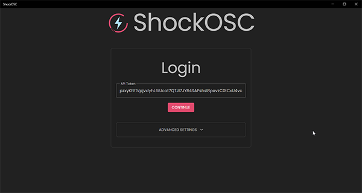
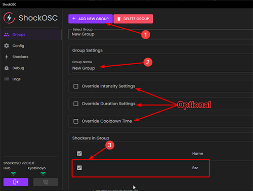
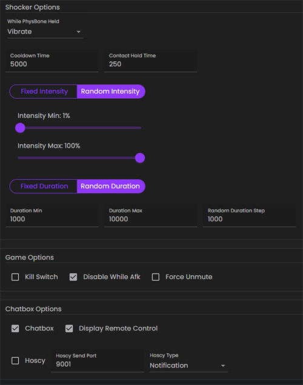

# Basic Setup

::: danger ShockOSC is now a Module in [OpenShock Desktop](https://github.com/OpenShock/Desktop)
Please go and download [OpenShock Desktop](https://github.com/OpenShock/Desktop) to use ShockOSC.
:::

::: info What is ShockOSC?
ShockOSC is an [OpenShock Desktop Module](https://github.com/OpenShock/Desktop) made for OSC to trigger your shockers from an in-game trigger.  
OSC is a protocol implemented in VRChat, ChilloutVR, etc. that allows the communication between the game and 3rd party applications.
:::

## What you need

- [Fully setup shocker](../openshock/first-setup.md)
- [Newest OpenShock Desktop with ShockOSC](https://github.com/OpenShock/Desktop/releases)
- [Shocklink Account](https://openshock.app/)

## Setup ShockOsc

1. [Download OpenShock Desktop](https://github.com/OpenShock/Desktop/releases/latest/download/OpenShock_Desktop_Setup.exe) and install it.
2. Login
    1. Open OpenShock (Desktop)
    2. Bottom left corner should say "Not Logged In", click it.
    3. Click Login, this will open your browser
    3. In the browser, log into your OpenShock account and accept the request shown.
    4. OpenShock Desktop will now be logged in.
    
3. Create your Shock Group.  
*everything is done in groups, doesn't matter if it's only one shocker or multiple shockers.*  
    1. Go to the Group Tab.
    2. Create a new Group.
    3. Give the Group a name. (This also defines the parameter name later used for your Avatar)  
    4. Select what shocker is to be used with the group.  
    5. *Optional you can override the default limits set in ShockOSC per group*
      
4. Configure your Limits.
    1. Go to the Config Tab
    2. Configure Cooldown, Hold time, if Intensity is fixed or random and the limits for that same with duration.
    3. Choose if ShockOSC pauses while being AFK and if it'll un-mute you when shocked.
    4. Everything else can be left alone unless you know what you are doing.  
    
5. That's it, you are ready to go! 🎉

::: tip Avatar Setup
Check out the [VRChat Avatar Setup](avatar-setup-vrc.md) or [ChilloutVR Avatar Setup](avatar-setup-cvr.md) Guide!  
:::
