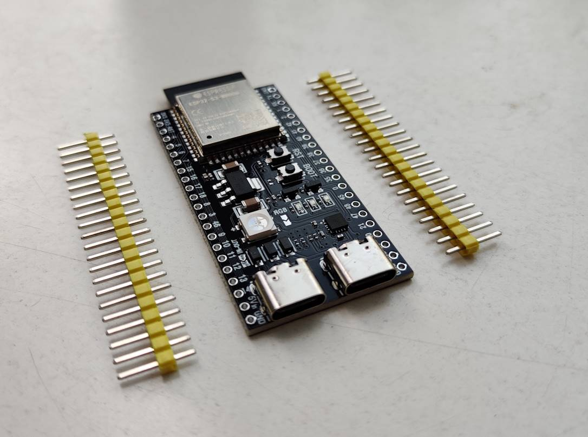

---
tags:
    - hardware
    - board
    - vendor:china
    - chip:esp32-s3
    - compat:full
    - support:maintainers
---

# ESP32-S3 "Dorx"
Codenamed "Dorx", this is a brandless knockoff ESP32-S3 board with a fake "ESP32-S3-WROOM-1" module.

## Variants
- `N8R2` -- 8MiB of flash, 2MiB of PSRAM
- `N16R8` -- 16MiB of flash, 8MiB of PSRAM

## Specifications
- ESP32-S3 (Knockoff)
- One WS2812B controllable LED
- One LED for each of R/G/B:
    - Red when the board is powered
    - Green for serial traffic
    - Blue while flashing

## Buying
- [https://aliexpress.com/item/1005005767192637.html](https://aliexpress.com/item/1005005767192637.html)

## Media

