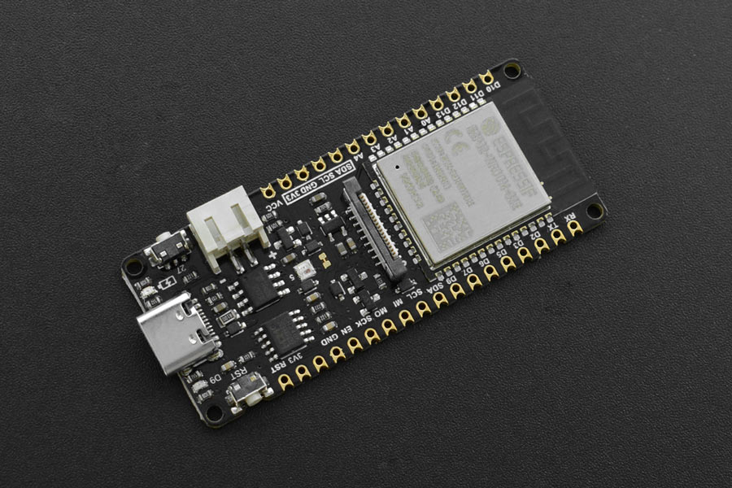

---
tags:
    - hardware
    - board
    - vendor:dfrobot
    - chip:esp32-e
    - compat:full
    - support:community
---

# DFRobot FireBeetle 2 ESP32-E

::: tip Fully compatible
This product is fully compatible with OpenShock.

:::
- [Official webpage](https://wiki.dfrobot.com/FireBeetle_Board_ESP32_E_SKU_DFR0654)

## Specifications

- ESP32-E
- Li-Po Battery Support
- USB Type C

## Pinout

- Pin 2 / D9 is used for the status LED.
- Pin 5 / D8 is used to control the onboard RGB LED.
- Pin 13 / D7 is the default pin for transmitting.

## Buying

- [www.dfrobot.com](https://www.dfrobot.com/product-2195.html)

## Media

