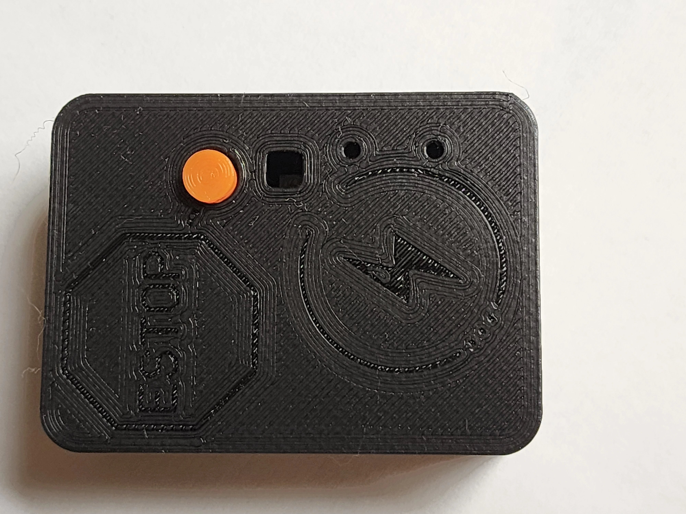
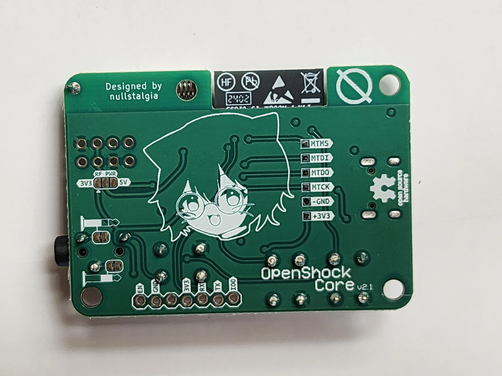
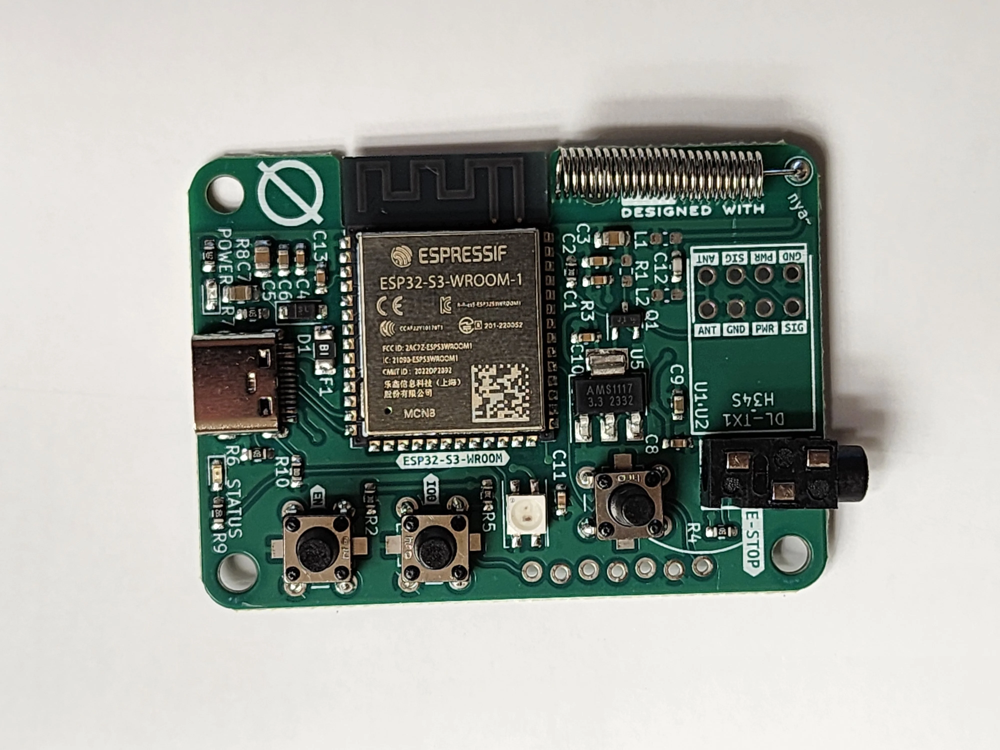
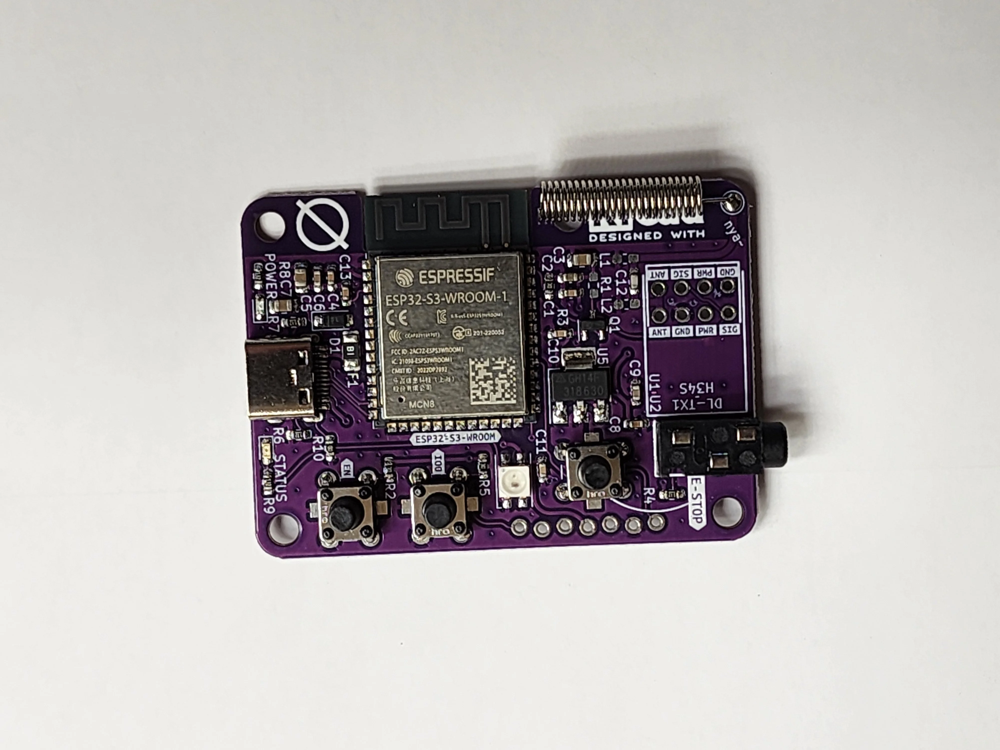

---
tags:
  - hardware
  - board
  - vendor:nullstalgia
  - chip:esp32s3
  - compat:full
  - support:full
---

# OpenShock Core V2

Designed by [nullstalgia](../../../vendors/hardware/nullstalgia.md)

!!! success "Fully compatible"
    This product is fully compatible with OpenShock.

## Specifications

- Espressif ESP32-S3-WROOM-1-N8 (8MB Flash, no PSRAM)
- USB-C Connection to integrated ESP32-S3 USB (no UART adapter)
- On-board 433 MHz Transmitter
- RGB (WS2812B) and Status LEDs
- On-board Emergency Stop Button, plus 3.5mm extension port (for foot pedals)

## Pinout

- GPIO 1 for RX Transmission
- GPIO 38 for Emergency Stop (Active Low, on board pull-up)
- GPIO 13 for Status LED (Active High)
- GPIO 14 for RGB (WS2812B) LED

## Flashing

If you are having difficulties flashing via the USB port, you can enter the USB Serial Download Mode.

You may require a pair of small pointy objects, such as toothpicks or paperclips, to reach the buttons mentioned below.

1. Plug the board into your computer via USB, make sure the cable can support power and data.
2. Hold down BOOT (IO 0).
3. While holding boot, tap RST (EN).
4. Release BOOT and upload new firmware via the virtual COM port!
5. You may need to tap RST (without BOOT!) to start new firmware after flashing has completed.

## Schematics and PCB files

[Freely available under the CERN-OHL-S-2.0 license here.](https://github.com/OpenShock/Hardware/tree/main/Core%20v2)

## Media

??? Info "V2.0 and Case"
    
    
    
    
    
    

??? Info "V2.2L PCB"
    
    
    
    
    
    
    