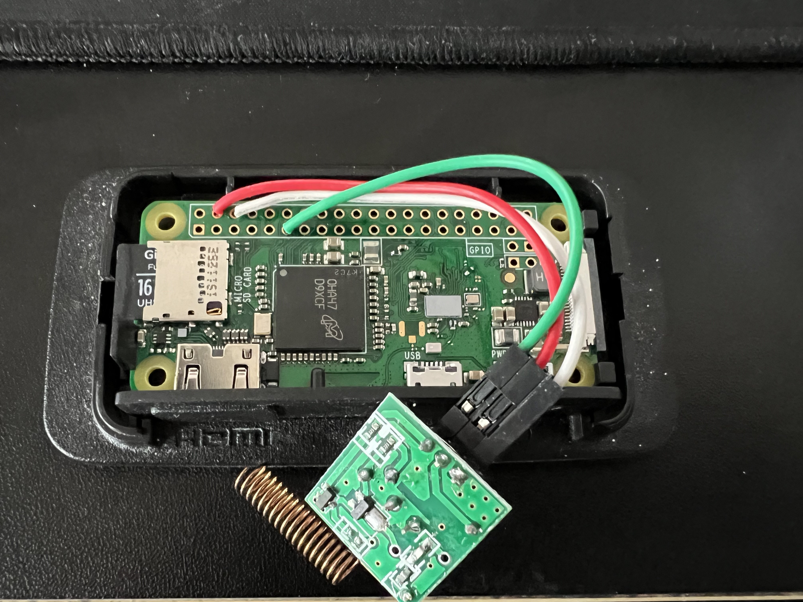

---
tags:
  - hardware
  - board
  - vendor:pishock
  - compat:none
  - support:none
---

# PiShock Plus (2021 Q1)

!!! warning "OpenShock is not affiliated with PiShock"
    We are not affiliated with PiShock in any way and do not endorse their products.

!!! failure "Not compatible"
    This product is not compatible with OpenShock.

## Specifications

This device is based on the [Raspberry Pi Zero W](https://www.raspberrypi.com/products/raspberry-pi-zero-w/), which is not compatible with OpenShock.

## Media

Thanks to `@nacho_` on Discord for the images.
