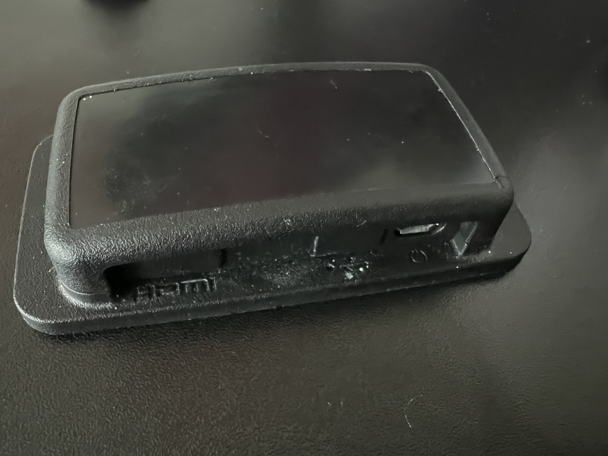
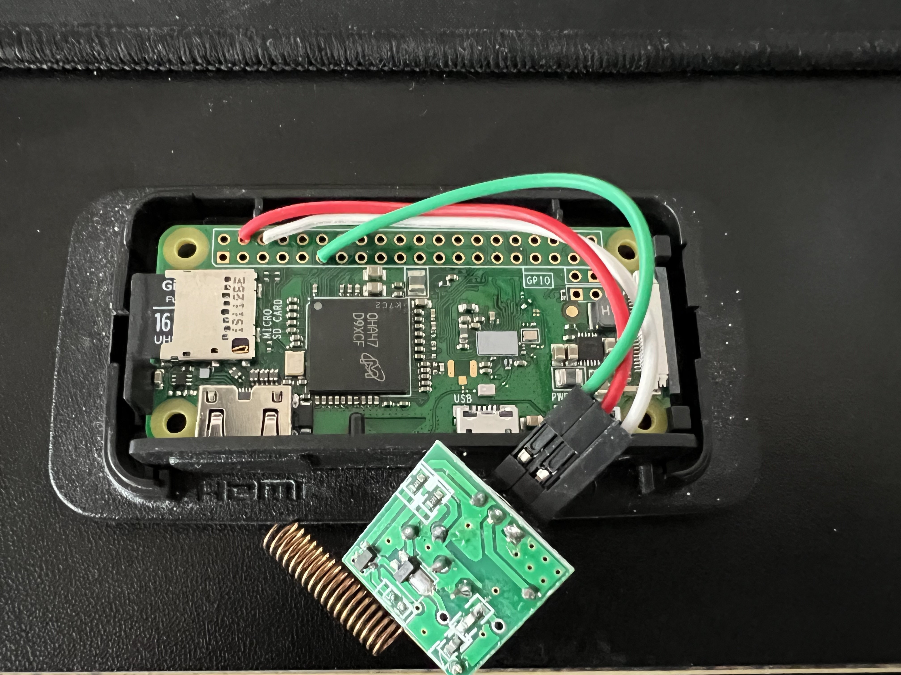

---
tags:
  - hardware
  - board
  - vendor:pishock
  - compat:none
  - support:none
title: PiShock Plus (2021 Q1)
description: PiShock Plus (2021 Q1) — Raspberry Pi Zero W based, not compatible with OpenShock.
icon: Cpu
---

<Callout type="warn" title="OpenShock is not affiliated with PiShock">
  We are not affiliated with PiShock in any way and do not endorse their products.
</Callout>
<Callout type="error" title="Not compatible">
  This product is not compatible with OpenShock.
</Callout>
## Specifications

This device is based on the [Raspberry Pi Zero W](https://www.raspberrypi.com/products/raspberry-pi-zero-w/), which is not compatible with OpenShock.

## Media

Thanks to `@nacho_` on Discord for the images.
