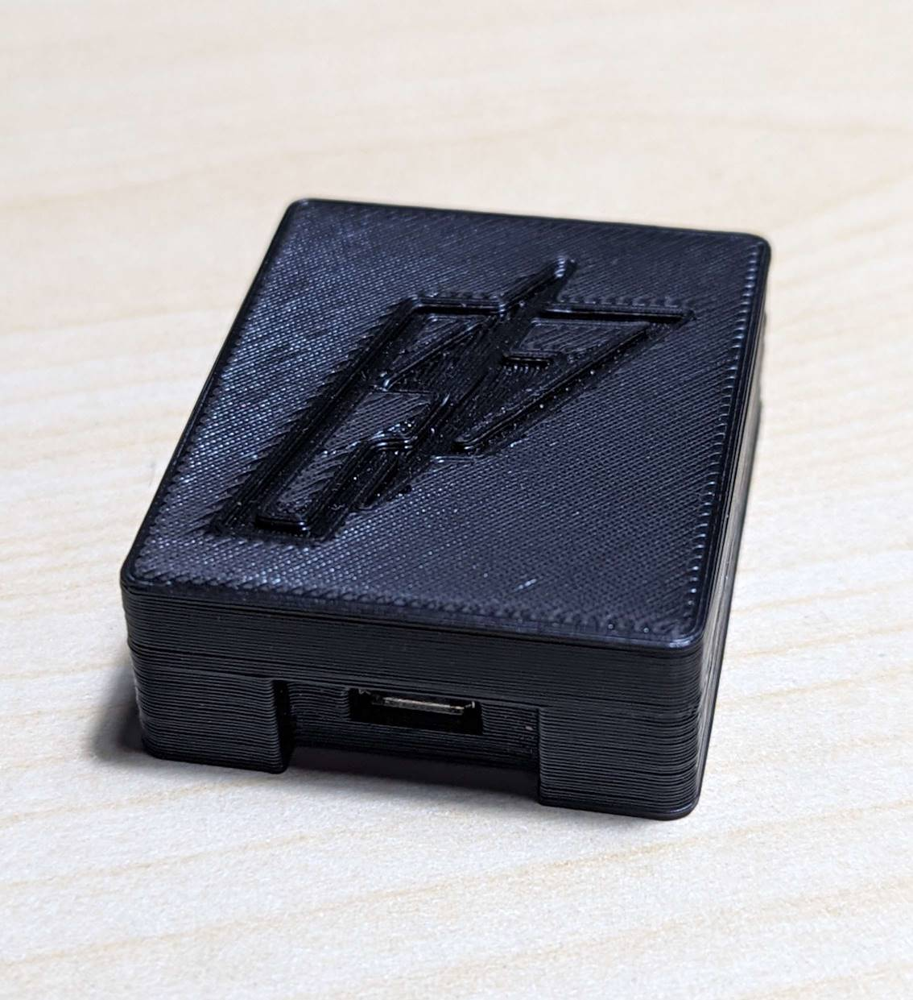

---
tags:
  - hardware
  - board
  - vendor:pishock
  - chip:esp32
  - compat:full
  - support:full
---

# PiShock Lite (2021 Q3)

!!! warning "OpenShock is not affiliated with PiShock"
    We are not affiliated with PiShock in any way and do not endorse their products. However, we do support flashing OpenShock on this board.

!!! success "Fully compatible"
    This product is fully compatible with OpenShock.

## Specifications

- Board is [Wemos D1 Mini ESP32](../wemos/d1-mini-esp32.md)
- Simple [433MHz radio board](../../radio/index.md)

## Pinout

- Pin 15 is used for transmitting.

## Media

### Clean variant

### Burnt solder joint variant

Courtesy of `@ulthirm` on Discord.

### Cold solder joint variant

Courtesy of `@pixelcommander` on Discord.

