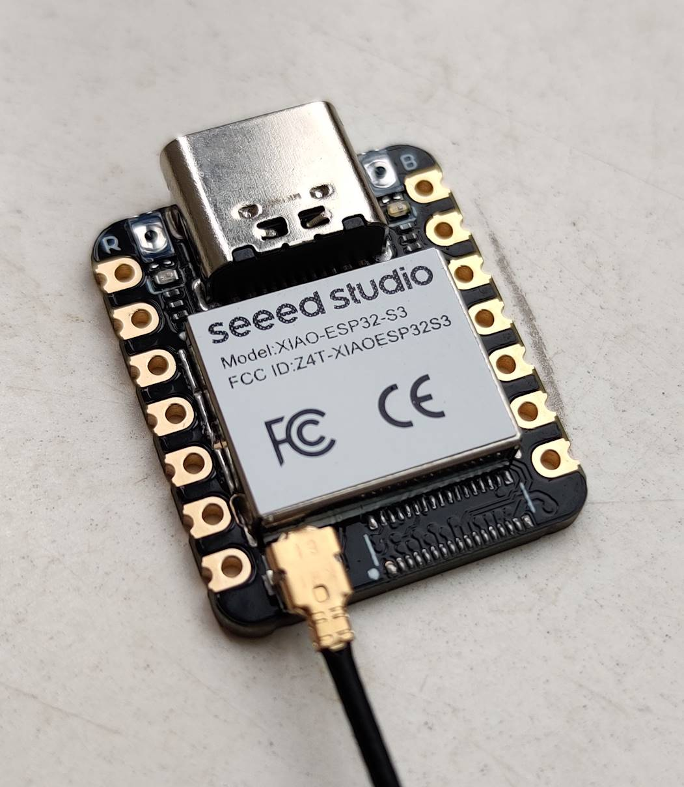

---
tags:
    - hardware
    - board
    - vendor:seeed
    - chip:esp32s3
---

# Seeed Xiao ESP32S3

## Flashing

On the first picture in the [Media section](#media) below, aside the USB-C are two (extremely small!) buttons.

- The "R" button is "Reset";
- The "B" button is "Bootloader".

To flash, you need to enter bootloader mode. Follow these steps:

- Unplug the board.
- Hold down the "B" button.
- Replug the board **while holding it down.**

If everything went correctly, you can now flash the board using a flashing tool like `esptool`. After flashing, press "R" to reset the board into normal boot mode.

## Media

