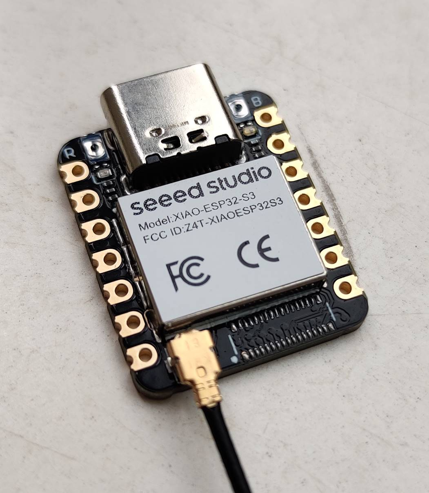
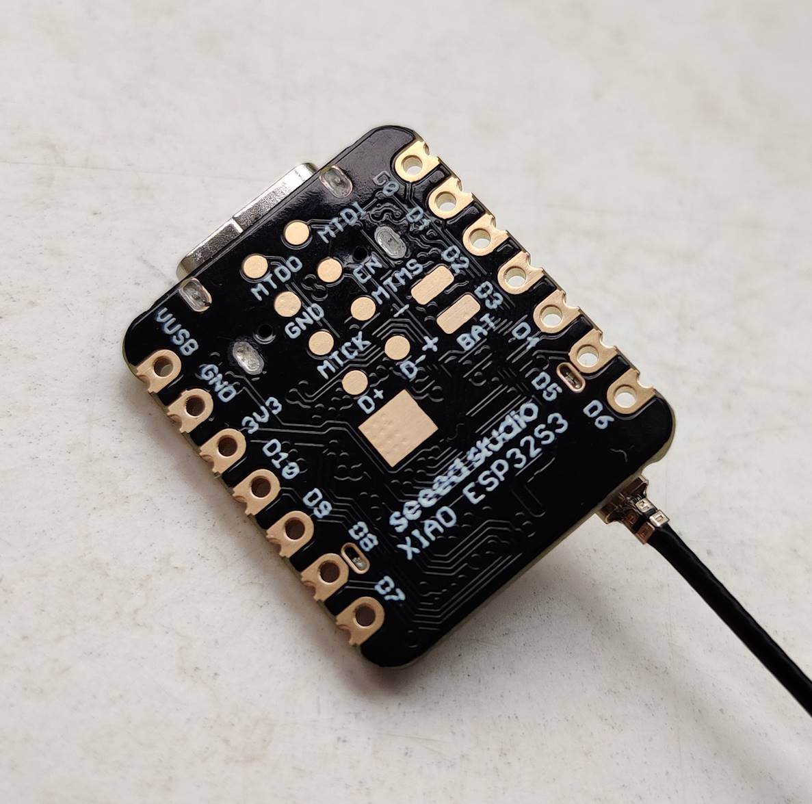
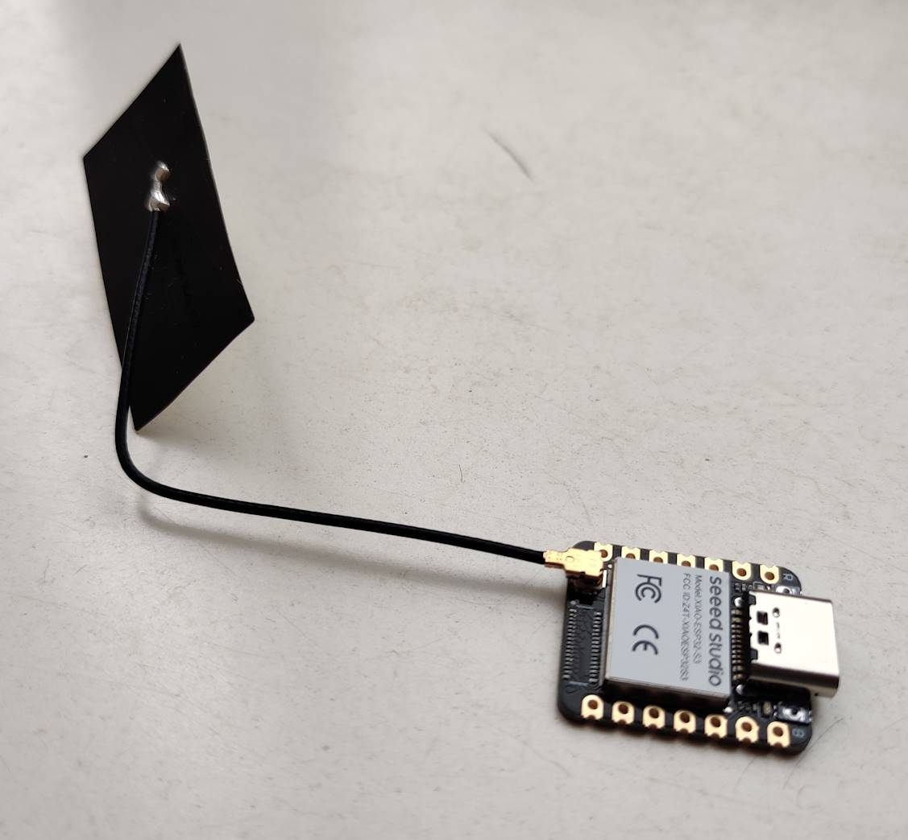

---
tags:
  - hardware
  - board
  - vendor:seeed
  - chip:esp32s3
title: Seeed Xiao ESP32S3
description: Seeed Xiao ESP32S3 — compact ESP32-S3 board with detachable antenna; fully compatible.
icon: Cpu
---

<Callout type="success" title="Fully compatible">
  This product is fully compatible with OpenShock.
</Callout>
See the [official webpage](https://www.seeedstudio.com/XIAO-ESP32S3-p-5627.html) for a more
exhaustive description.

## Specifications

- ESP32-S
- 8MiB Flash
- 8MiB PSRAM
- Detachable antenna

<Callout type="warn" title="Inconsistent Pin Labels">
  The pin labels printed on the board do *not* match the ESP32-S3's actual GPIO numbers. Please
  refer to the [official Seeed
  documentation](https://wiki.seeedstudio.com/xiao_esp32s3_getting_started/#hardware-overview) to
  find the correlations between the printed labels and the actual GPIO numbers.
</Callout>
## Flashing

<Callout type="warn" title="Extra steps required">
  Please read this section carefully.
</Callout>
On the first picture in the [Media section](#media) below, aside the USB-C are two (extremely
small!) buttons.

- The "R" button is "Reset";
- The "B" button is "Bootloader".

To flash, **you need to enter bootloader mode**. Follow these steps:

- Unplug the board.
- Hold down the "B" button.
- Replug the board **while holding it down.**

If everything went correctly, you can now flash the board using a flashing tool like `esptool`. After flashing, press "R" to reset the board into normal boot mode.

## Media

<Callout type="info">
  The antenna is detachable. The back side of the antenna has adhesive tape.
</Callout>

