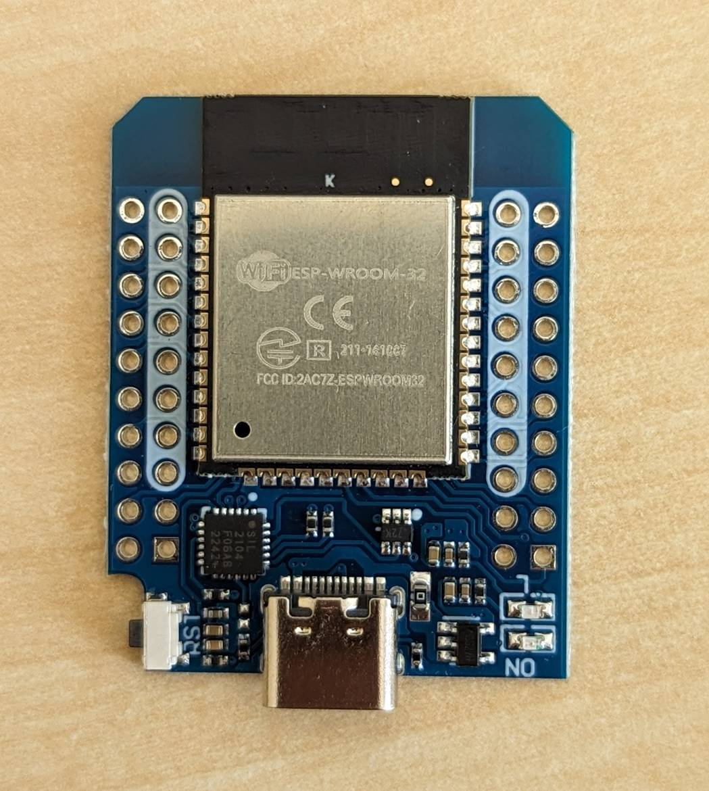

---
tags:
    - hardware
    - board
    - vendor:wemos
    - chip:esp32
---

# Wemos D1 Mini ESP32

!!! success "Fully compatible"

    This product is fully compatible with OpenShock.

## Specifications

!!! example "Still brewing!"

    Sorry, we haven't _quite_ finished this article yet. **In the meantime, feel free to hit us up on [Discord](https://discord.gg/AHcCbXbEcF) if you have any trouble.**

## Buying

| Availability | Variant | Links |
|-|-|-|
| :globe_with_meridians: International 1 | FeiYang | [AliExpress](https://de.aliexpress.com/item/32858054775.html) |

## Media

### FeiYang variant

Credit to `minty_kitsune` on Discord.
