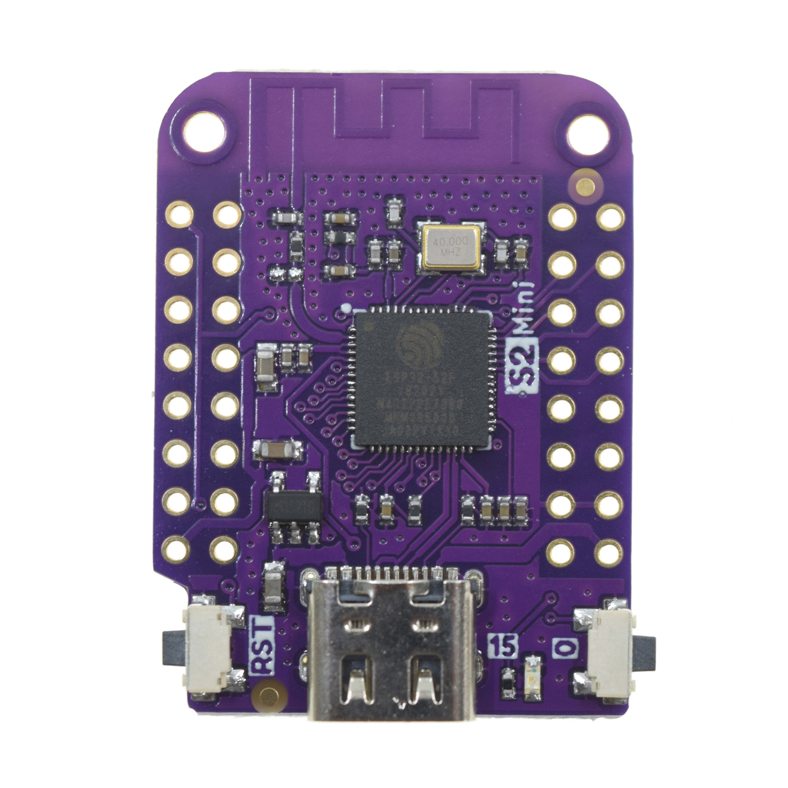

---
tags:
    - hardware
    - board
    - vendor:wemos
    - chip:esp32-s2-mini
---

# Wemos Lolin S2 Mini

::: tip Fully compatible

This product is fully compatible with OpenShock.

:::
- [Official webpage](https://www.wemos.cc/en/latest/s2/s2_mini.html)

## Specifications

- ESP32-S2FN4R2
- 4MB Flash
- 2MB PSRAM

## Media

