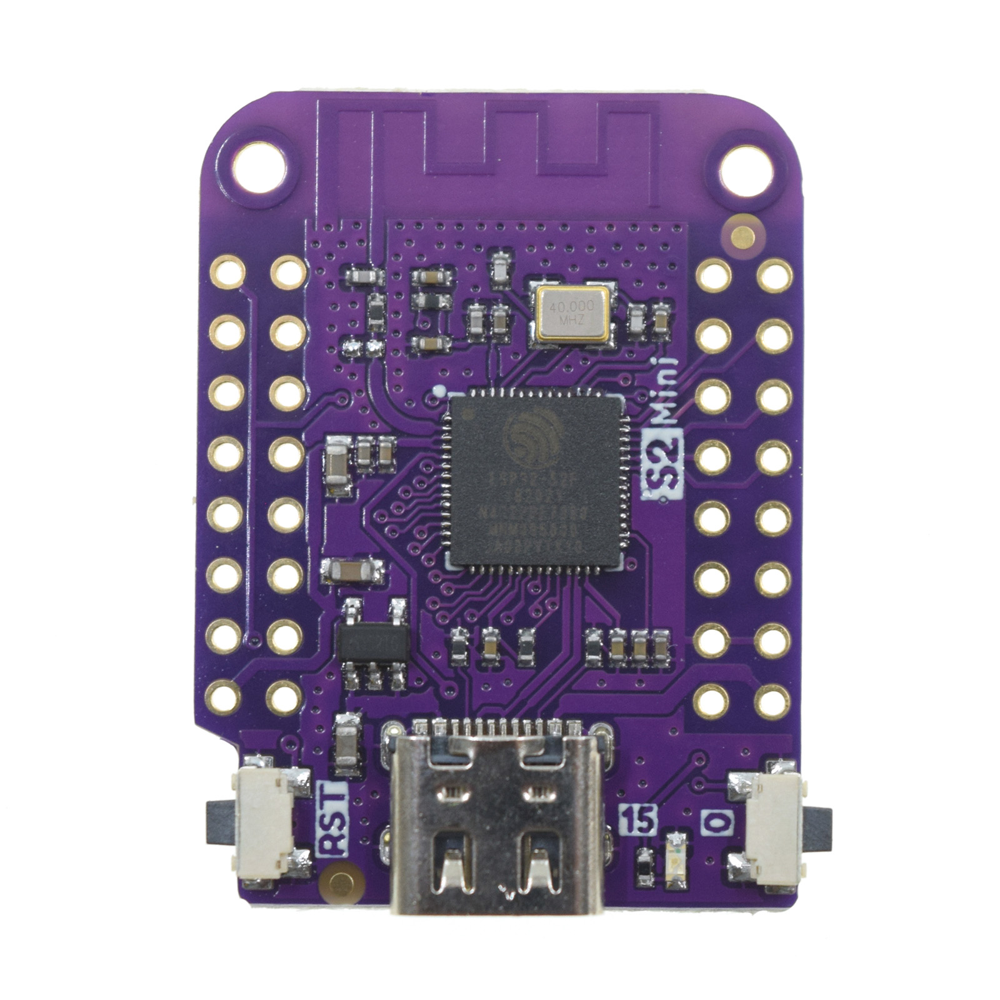
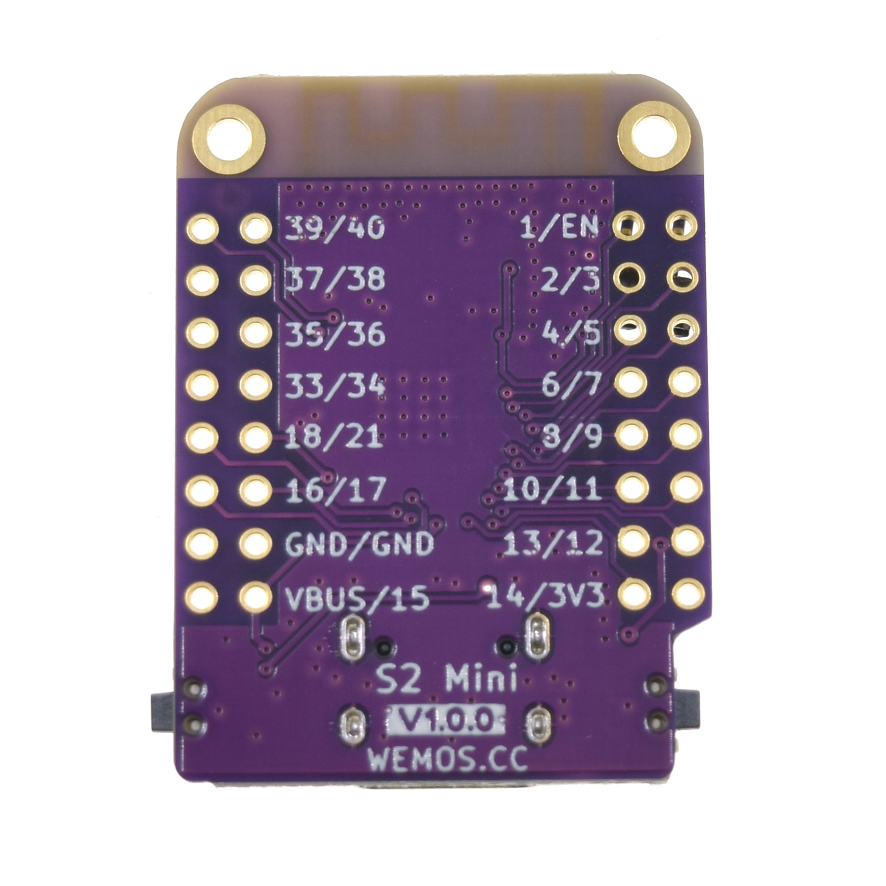

---
tags:
    - hardware
    - board
    - vendor:wemos
    - chip:esp32-s2-mini
title: Wemos Lolin S2 Mini
icon: Cpu
---

<Callout type="success" title="Fully compatible">
This product is fully compatible with OpenShock.
</Callout>
- [Official webpage](https://www.wemos.cc/en/latest/s2/s2_mini.html)

## Specifications

- ESP32-S2FN4R2
- 4MB Flash
- 2MB PSRAM

## Media

