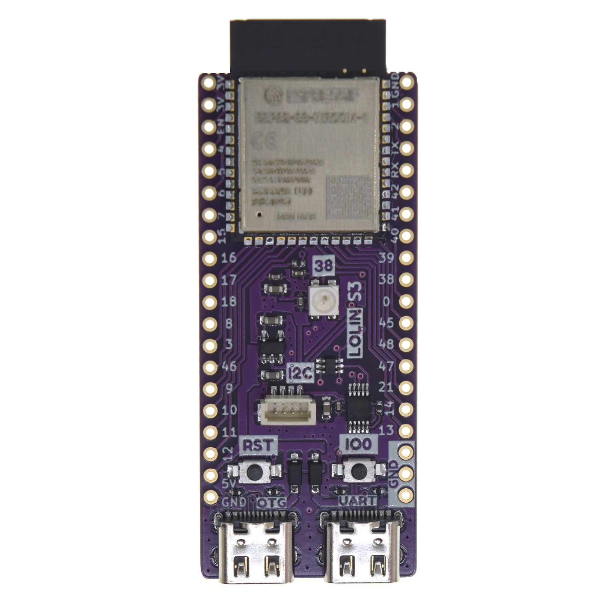

---
tags:
    - hardware
    - board
    - vendor:wemos
    - chip:esp32-s3
---

# Wemos Lolin S3

::: tip Fully compatible

This product is fully compatible with OpenShock.

:::
- [Official webpage](https://www.wemos.cc/en/latest/s3/s3.html)
- [AliExpress](https://www.aliexpress.com/item/1005004643475363.html?spm=a2g0o.store_pc_home.0.0.276d4ff12EF3UH)

## Specifications

- ESP32-S3-WROOM-1
- 16MB Flash (Quad SPI)
- 8MB PSRAM (Octal SPI)

## Media

