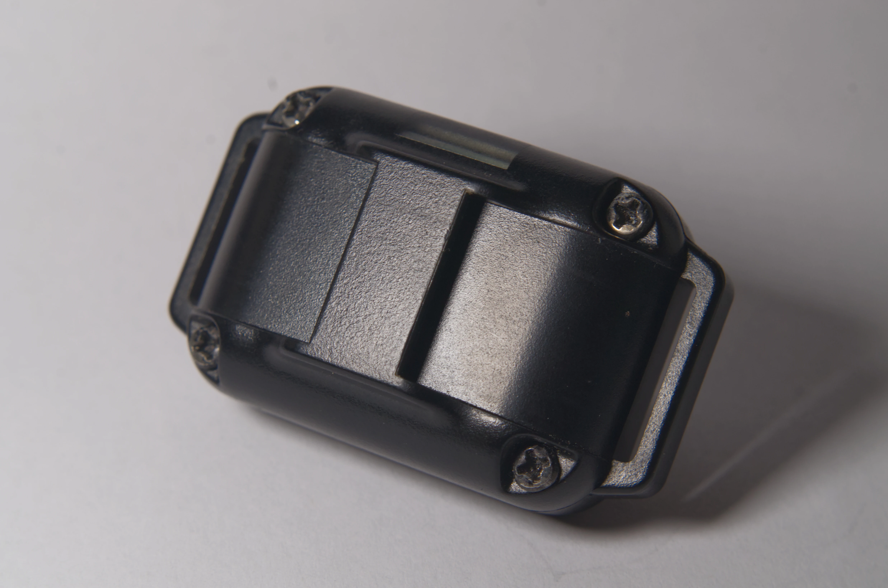

---
tags:
    - hardware
    - shockers
---

# CaiXianlin

::: tip Compatible
This product is compatible with OpenShock.

:::
Cheap and easily acquirable.

## Buying

### Shockers

Best effort list of current AliExpress sellers. Feel free to add more sources to this list!

- :globe_with_meridians: International: [AliExpress](https://aliexpress.com/item/1005005133046985.html)
- :globe_with_meridians: Alternative: [AliExpress](https://aliexpress.com/item/1005005823699736.html)

### Cables

The charging port for this model is a standard **DC 3.5 x 1.35mm**. A USB to **DC 3.5 x 1.35mm** cable is used to charge the shocker. You might even have one laying around as they are common.

- :globe_with_meridians: International: [AliExpress](https://aliexpress.com/item/2255799944669970.html)
- :globe_with_meridians: International: [AliBaba](https://www.alibaba.com/product-detail/MZ-880-Waterproof-Rechargeable-Vibrating-Dog_1600152421803.html?spm=a2756.trade-list-buyer.0.0.591076e9bwDzlP)

## Media




Thank you `@dasbrin` on Discord for the images.


## Technical Specification

### Official documents

[US Patent Document 1](https://uspto.report/patent/grant/D879,390)

[US Patent Document 2](https://image-ppubs.uspto.gov/dirsearch-public/print/downloadPdf/D879390)

### Community Reversed Engineered documents

[Shocker & Remote Documents on GitHub](https://github.com/Nat-the-Kat/caixianlin_remote_shocker) by @Nat-the-Kat

### RF Specification

| Name              | Value      |
|-------------------|------------|
| Carrier Frequency | 433.95 MHz |
| Modulation Type   | ASK / OOK  |

### Bit encoding

| Type | High duration | Low duration |
|------|---------------|--------------|
| Sync | 1400µs        | 750µs        |
| 1    | 750µs         | 250µs        |
| 0    | 250µs         | 750µs        |

### Packet fields

| Name              | Value      | Length    | Remarks                                  |
|-------------------|------------|-----------|------------------------------------------|
| Transmitter ID    | 0 - 65535  | 16 bits   | The collar will be Paired to this        |
| Channel Number    | 0 - 2      | 4 bits    | The collar will be Paired to this        |
| Action Command    | 1 - 3      | 4 bits    | 1 = Shock, 2 = Vibrate, 3 = Beep         |
| Command Intensity | 0 - 99     | 8 bits    | Should always be 0 for beep              |
| Message checksum  | 0 - 255    | 8 bits    | 8-bit sum of all other fields as a int32 |

### Layout

```text
[PREFIX        ] = SYNC
[TRANSMITTER ID] =     XXXXXXXXXXXXXXXX
[CHANNEL       ] =                     XXXX
[MODE          ] =                         XXXX
[STRENGTH      ] =                             XXXXXXXX
[CHECKSUM      ] =                                     XXXXXXXX
[END           ] =                                             00
```

## Working C++ code

[Firmware CaiXianlin Encoder](https://github.com/OpenShock/Firmware/blob/develop/src/radio/rmt/CaiXianlinEncoder.cpp)

## Example untested RFCat code

```py
# Import the necessary libraries and functions
from rflib import *
import time

# Set up the RfCat device
d = RfCat()
d.setPktPQT(0)
d.setMdmNumPreamble(0)
d.setEnableMdmManchester(False)
d.setFreq(433950000)
d.setMdmModulation(MOD_ASK_OOK)
d.setMdmDRate(3950)
d.makePktFLEN(22)
d.setMdmSyncWord(0)
   
"""
Returns the string representation of the action (Shock, Vibrate, or Beep)
"""
def get_action_string(action):
   if action == 1:
      return 'Shock'
   elif action == 2:
      return 'Vibrate'
   elif action == 3:
      return 'Beep'
   else:
      return 'Unknown'

# Since the receivers only support 3 channels, we can change the transmitter ID to extend the number of channels
for transmitter_id in range(46231, 46233):
   # Loop through the channels
   for channel in range(3):
      # Loop through the actions
      for action in range(1, 4):
         # Loop through the intensities, but not if the action is 3 (beep)
         for intensity in range(0, 100, 10) if action != 3 else [0]:

            # Intensity has max of 99
            if intensity == 100:
               intensity = 99

            # Assemble the payload
            payload = (transmitter_id << 24) | (channel << 20) | (action << 16) | (intensity << 8)

            # Calculate the checksum (sum(bytes) % 256)
            checksum = 0
            for i in range(8):
               checksum += (payload >> (i * 8)) & 0xFF
            checksum %= 256

            # Add the checksum to the payload
            payload |= checksum

            # Assemble the message
            message = bytes.fromhex('fc{0:040b}88'.format(payload).replace('1', 'e').replace('0', '8'))

            print('Sending {0} on channel {1} with intensity {2} and checksum {3}'.format(get_action_string(action), channel, intensity, checksum))

            # Transmit the message 5 times
            for i in range(5):
               d.RFxmit(message)
```
