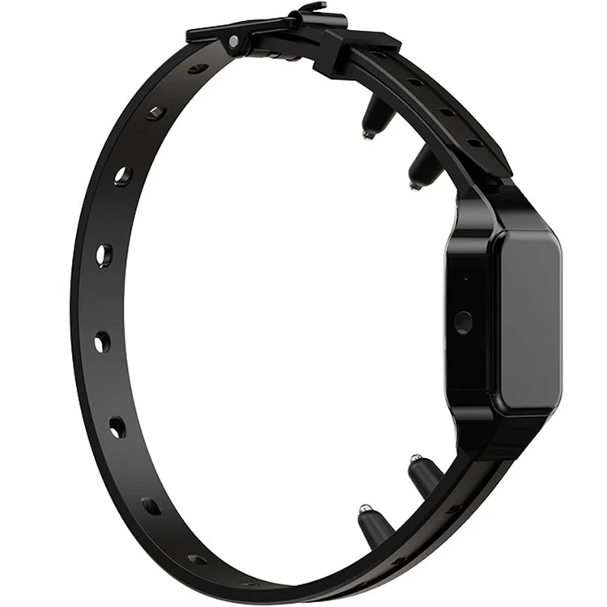

---
tags:
    - hardware
    - shockers
---

# Wellturn T330

::: tip Compatible
This product is compatible with OpenShock.

::: danger Lack of dashboard support
Cannot be added on the dashboard (openshock.app) and only useable via rf commands through the terminal.

::: danger Highly priced
Highly priced and barely available.

## Buying

# Official Wellturn Stores

- :globe_with_meridians: [Alibaba](https://www.alibaba.com/product-detail/Dog-Remotely-Collar-1000-Feet-2_1600772049827.html)
- :globe_with_meridians: [Alibaba](https://www.alibaba.com/product-detail/300m-Professional-Remote-Dog-Training-Collar_1600693067072.html)

# 3rd Party Stores

- :globe_with_meridians: [Alibaba](https://www.alibaba.com/product-detail/Circular-Rechargeable-Waterproof-Shock-Collar-Powerful_1601679214819.html)
- :globe_with_meridians: [Alibaba](https://www.alibaba.com/product-detail/2025-Automatic-Pet-Stop-Barking-Collar_1601596339209.html)
- :globe_with_meridians: [Chewy](https://www.chewy.com/petdiary-t330-waterproof-dog-remote/dp/892782)

## Official documents

- :page_facing_up: [User Manual](https://device.report/m/8edab0c9b7b69de0a98ad223b5e832501970825440d8abbd58300d6feea59dd1_optim.pdf)

## Media

