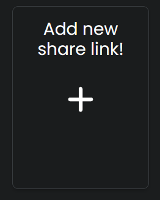
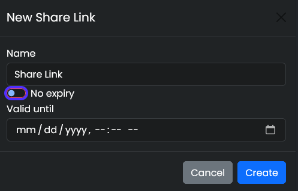
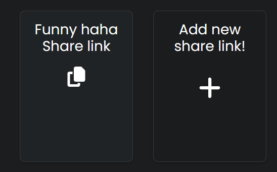
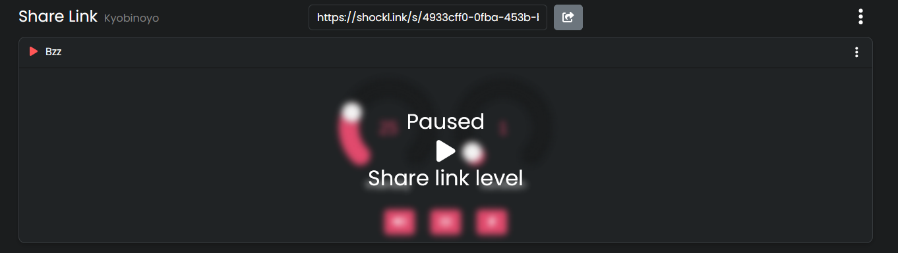

# Shock link - Share links

!!! Warning
    Don't wear the shocker somewhere near your neck or your heart  
    
## What you need
1. [Shocklink.net account](https://shocklink.net/)
2. A completely setup shocker ([see the First time Setup guide](../quickstart/first-setup.md))

## How to create a Share link

  1. Open [Shocklink.net](https://shocklink.net/) and go to the ``Share Links`` section.  
    

  2. Click ``Add new share link``  
  

  3. Here you can choose to set an expiry date and a name, after that press "Create"  
  
Your new share link should popup as a new entry looking like this:  
  

  4. Now that you have created the link itself you need to add one or multiple shockers to it so they can be triggered via this link, for this you click on the new entry, this will bring up the links page, on the top right there are three dots that open the ``context menu`` of the link. looking like this:  
  
  
  5. There you click on ``Add shocker`` and choose your shocker you can add multiple shockers, just repeat this step.  
  

  6.  After adding your shocker to the link you should be able to see the shockers controlls, that's it. Everyone with the share link can now controll your shocker.

## Customize your Share link
!!! Info ""
    You can set limits to ``strenght``, ``duration`` or what kind of ``command`` someone can use for each share link.  
    You can also ``Pause`` the link so nobody can send commands via this link.  
### Edit the limits  
  1. Open your share link page again and select the share link you want to edit, there you open the share links context menu and choose ``Edit Mode``.
    
  
  2. The shocker controlls should now be orange indicating the ``Edit Mode``.
    
  
  3. You can now set the maximum strenght, duration and choose what kind of command can be send Sound, Vibrate or Shock.

  4. To exit the Edit Mode open the share links context menu again and choose ``Edit Mode``, this will return the controlls to their normal color indicating that the Edit Mode is not active anymore.  
### Pause your Share link
  1. To ``Pause`` your share link open the links page and click on the little pause icon next to the share links name.  
  

  2. This will turn the pause icon into a red play icon and ``blur`` the shocker controlls telling you it's paused, as long as the link is paused it will not accept any commands.
  

  3. To unpause the share link again simply click on the ``Play Icon``.

  

  
