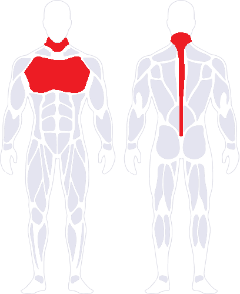

# Safety Rules

!!! warning "Disclaimer"
    Information provided on this wiki does not constitute or imply endorsement and is provided purely for informational purposes. OpenShock does not claim any liability for misuse of the information on this site.

!!! danger "DO NOT wear your Shockers near these Zones"
      

!!! danger "Do not touch the pins of the shocker with both hands at the same time" 
    The electricity will flow through your heart. 

## Consequences

Wearing the shocker near any of these Zones can cause:  

- Heart Attack  
- Irregular heartbeat  
- Breathing irregularities or difficulty  
- Vision or hearing issues  
- Loss of consciousness

If you notice any of these symptoms contact emergency services immediately.

## Handling the Shocker

You are playing with Electricity, always handle it with care.  

- Do not not touch the pins of the shocker while it's on, it may not cause permanent damage to your hand but it is extremely painful.  

## Consent

Please keep in mind that this is an adult toy (18+) with the purpose of inflicting pain on your partner and should only be used with consent.
