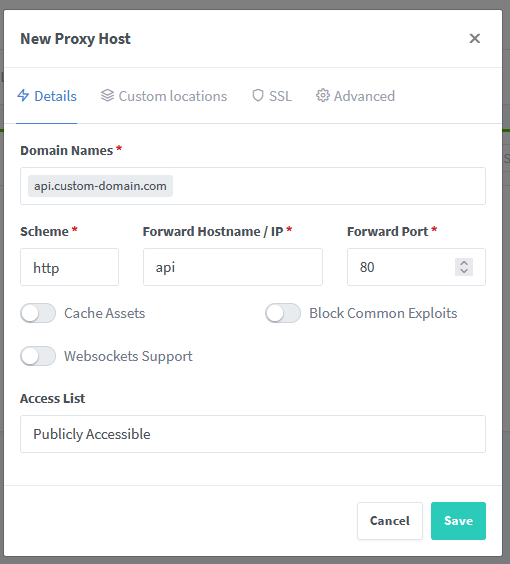
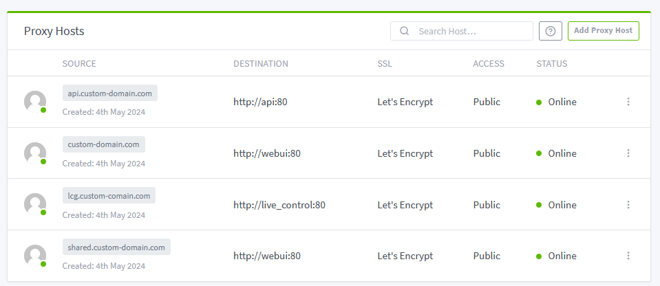

# Selfhosting

## Requirements

Hardware: 

1. A computer. Linux or windows would work. 
2. Compatible hardware board and a shocker

Software: 

1. [Python 3.6+](https://www.python.org/downloads/) (Current latest should work fine.)
2. [Visual Studio Code](https://code.visualstudio.com/) with [PlatformIO addon](https://marketplace.visualstudio.com/items?itemName=platformio.platformio-ide)
3. [Docker Desktop](https://docs.docker.com/desktop/install/windows-install/) on Windows or [Docker Engine](https://docs.docker.com/engine/install/) on Linux.
4. [Node 20](https://nodejs.org/en/download)

Other:

1. A domain name that points to the server's ip address
2. A https certificate (optional if the domain was purchased from a Let's encrypt compatible vendor)

## Preparing the server

Install software from the [Requirements](#requirements) on the server, make a new folder in a known location. In it, create a file called `docker-compose.yaml` and open it in VSCode.

### Docker compose setup

Use the template, paste it in `docker-compose.yaml` file and edit according to instructions below.

???Template
    ```yaml

    services:
        reverse-proxy:
            restart: unless-stopped
            image: 'jc21/nginx-proxy-manager:latest'
            ports:
                # ports forwarded outside
                - '80:80'
                - '443:443'
                # Admin Web Port
                - '81:81'
            networks:
                - reverse-proxy
            volumes:
                - reverse-proxy-data:/data
                - reverse-proxy-letsencrypt:/etc/letsencrypt

        postgres:
            image: postgres:16
            restart: unless-stopped
            networks:
                - openshock
            environment:
                - POSTGRES_PASSWORD=password
                - POSTGRES_USER=openshock
                - POSTGRES_DB=openshock
            volumes:
                - openshock-pg-data:/var/lib/postgresql/data

        redis:
            image: redislabs/redisearch:latest
            restart: unless-stopped
            networks:
                - openshock

        api:
            image: ghcr.io/openshock/api:latest
            restart: unless-stopped
            networks:
                - openshock
                - reverse-proxy
            depends_on:
                - postgres
                - redis
                - cron
            environment:
                OPENSHOCK__DB__CONN: Host=postgres;Port=5432;Database=openshock;Username=openshock;Password=password
                OPENSHOCK__REDIS__HOST: redis
                OPENSHOCK__FRONTENDBASEURL: https://custom-domain.com
                OPENSHOCK__COOKIEDOMAIN: custom-domain.com
                OPENSHOCK__MAIL__SENDER__EMAIL: admin@custom-domain.com
                OPENSHOCK__MAIL__SENDER__NAME: custom-domain-admin
                OPENSHOCK__MAIL__TYPE: SMTP
                OPENSHOCK__MAIL__SMTP__HOST: smtp.custom-domain.com
                OPENSHOCK__MAIL__SMTP__USERNAME: admin
                OPENSHOCK__MAIL__SMTP__PASSWORD: smtp-server-password
                OPENSHOCK__TURNSTILE__ENABLE: False

        webui:
            image: ghcr.io/openshock/webui:latest
            restart: unless-stopped
            environment:
                - OPENSHOCK_NAME=Custom-name
                - OPENSHOCK_URL=https://custom-domain.com
                - OPENSHOCK_SHARE_URL=https://shared.custom-domain.com
                - OPENSHOCK_API_URL=https://api.custom-domain.com
            depends_on:
                - api
                - live_control
            networks:
                - reverse-proxy

        live_control:
            image: ghcr.io/openshock/live-control-gateway:latest
            restart: unless-stopped
            networks:
                - openshock
                - reverse-proxy
            environment:
                OPENSHOCK__DB: Host=postgres;Port=5432;Database=openshock;Username=openshock;Password=password
                OPENSHOCK__REDIS__HOST: redis
                OPENSHOCK__COUNTRYCODE: DE
                OPENSHOCK__FQDN: lcg.custom-domain.com

        cron:
            image: ghcr.io/openshock/cron:master
            restart: unless-stopped
            networks:
                - openshock
            environment:
                OPENSHOCK__DB: Host=postgres;Port=5432;Database=openshock;Username=openshock;Password=password
                OPENSHOCK__REDIS__HOST: redis

    networks:
        openshock:
        reverse-proxy:


    volumes:
        openshock-pg-data:
        reverse-proxy-data:
        reverse-proxy-letsencrypt:

    ```

Variables that must be changed:

* POSTGRES_PASSWORD, and the password field in every DB_CONN string (Password=PUT_NEW_PASSWORD_HERE;)
* Every instance of "custom-domain.com". it needs to be replaced with a domain you own.
* Everything in email configuration. consult api's README.MD for information on how to configure that [TODO: LINK]. add a note about that the config is not verified and you can put bollocks data, and the api will still work? tested as of version 2.5.2 of api


Variables that can be changed:

* OPENSHOCK_NAME, can be set to any value. it'll show in places around the web ui.
* subdomain parts of each url/fqdn.
* OPENSHOCK__COUNTRYCODE, can be set to anything. It is used to select a gateway closest to you if there are multiple. and shouldn't have any effect if there is only one LCG running.

Variables that shouldn't be changed

* Host=postgres and Port=5432 parts of the DB_CONN variables. The host must be the same as the name of the postgres service definition.
* OPENSHOCK__REDIS__HOST, same as above. Must equal name of the redis service definition.

For more information consult readme.md files of each service [TODO: add links]


### Reverse proxy

Run the docker-compose stack with `docker compose up` command in the same folder that docker-compose.yaml is created. Then open the admin panel on port 

The default login and password is `admin@example.com` and `changeme`

#### Configuring proxy hosts

Add a Proxy Host for each: api, webui, live_control. Make sure that the FQDN for each container is correct.

In the above docker-compose those would be correct: 

* api -> api.custom-domain.com
* webui -> custom-domain.com 
* live_control -> lcg.custom-domain.com

Example configuration for the API proxy host:



* Domain Names: Put the FQDN here. 
* scheme: leave as http (What scheme reverse-proxy will use to communicate with the container)
* forward hostname/ip: Put in the name of the service specified in docker-compose ("api" for the api, "webui" for webui etc.)
* forward port: leave at 80

The rest of the settings can be left as is, except the SSL tab. You must set a SSL certificate for each proxy host. Either use Let's encrypt, or add your own SSL certificate in the "SSL certificates" tab.

#### making share links work

Add a proxy host with the FQDN set in OPENSHOCK_SHARE_URL variable, set settings the same as webui config from the previous step. Open the "Advanced" tab and paste the following config into "Custom Nginx Configuration" field:

```apacheconf
    # Redirect share links
    location /s/ {
        rewrite ^/s/(.*)$ https://custom-domain.com/#/public/proxy/shares/links/$1 redirect;
    }
    # Redirect shocker codes
    location /c/ {
        rewrite ^/c/(.*)$ https://custom-domain.com/#/public/proxy/shares/code/$1 redirect;
    }

    # Catch-all location block for everything else
    location / {
        return 404;
    }
```

Final proxy hosts list should look similar to the following:


Congratulations, the backend and website should be working now. Next up: building and flashing firmware for the shockers to work with the self-hosted instance. 

## Firmware setup

Clone the [firmware repository](https://github.com/OpenShock/Firmware) and open the directory with visual studio code. Wait for platform.io to configure the project (you might need to restart VSCode, the process will take about 2-3 minutes)

### Configuring the Firmware

Open the .env file in the root of the directory, and edit it accordingly. Below is a example configuration for server setup with the template above.

```ini
OPENSHOCK_API_DOMAIN=api.custom-domain.com
OPENSHOCK_FW_CDN_DOMAIN=custom-domain.com
OPENSHOCK_FW_VERSION=1.2.1-selfhosted
OPENSHOCK_FW_HOSTNAME=custom-domain
OPENSHOCK_FW_AP_PREFIX=selfhosted-openshock-
OPENSHOCK_URI_BUFFER_SIZE=256
```
Explanation of config options:

* OPENSHOCK_API_DOMAIN: FQDN of the api. 
* OPENSHOCK_FW_CDN_DOMAIN: FQDN of where the firmware was downloaded from. (since this is customized firmware, i set it to the FQDN of the webui.)
* OPENSHOCK_FW_VERSION: version string that will show up in the webui (Image below)
* OPENSHOCK_FW_HOSTNAME: Will be used in useragent, and during setup to access the captive portal
* OPENSHOCK_FW_AP_PREFIX: Prefix for the wifi hotspot name you'll need to connect to to setup the board.
* OPENSHOCK_URI_BUFFER_SIZE: only needs to be changed if the FQDN for the site is very long. (the monitor will log the need to do so. Default value should be sufficient for most domain names.)


### Build and flash

Plug in your board, open Platform.io panel (on the left vertical bar), select your board, and run "General/Build" and "Platform/Build Filesystem Image" (the tasks might not show up at first, but should appear after a second.)

After both succeed, run "General/Upload" and "Platform/Upload Filesystem Image". After both are successful, reboot the board and run "General/Monitor" task to view the logs, but everything should be set up to follow the [First time setup](../guides/openshock-first-setup.md) section of the wiki.

## Troubleshooting

Use the monitor from platformio and logs from the api service, in most cases the error is a misconfiguration of the api